# Session 14: Kubernetes Troubleshooting Assignment
### `kubectl get pods` Screenshot

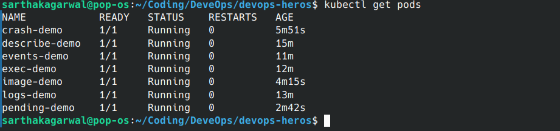
### `kubectl get all` Screenshot

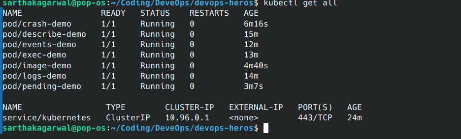

Work through the exercises in order. Run the commands from the repository root:

```bash
cd /home/sarthakagarwal/Coding/DeveOps/devops-heros
```

After each exercise, paste a screenshot of the terminal output in the space provided.

## Prerequisites

- A running Kubernetes cluster
- `kubectl` configured for the cluster

Check the connection:

```bash
kubectl cluster-info
kubectl get nodes
```

### Screenshot

<br><br><br>

## 1. Inspect Resources with `kubectl get`

Apply the sample workload:

```bash
kubectl apply -f session-14-kubernetes-troubleshooting/01-kubectl-get/sample-workload.yaml
```

Inspect the Pod and other resources:

```bash
kubectl get pods
kubectl get pods -o wide
kubectl get services
kubectl get deployments
kubectl get nodes
kubectl get all
```

Watch the Pod, then delete it from another terminal:

```bash
kubectl get pods -w
kubectl delete pod get-demo
```


### Screenshot

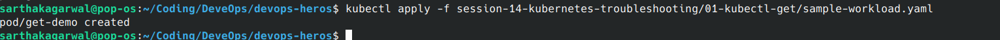
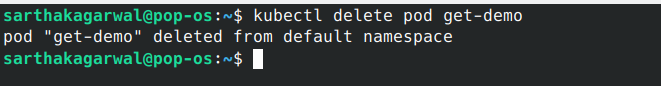
<!-- Paste the screenshot showing kubectl get commands and their output here. -->

<br><br><br>

## 2. Inspect Details with `kubectl describe`

Create the demo Pod:

```bash
kubectl apply -f session-14-kubernetes-troubleshooting/02-kubectl-describe/demo-pod.yaml
kubectl get pod describe-demo
```

Describe the Pod and inspect the `Containers`, `Conditions`, and `Events` sections:

```bash
kubectl describe pod describe-demo
```

### Screenshot
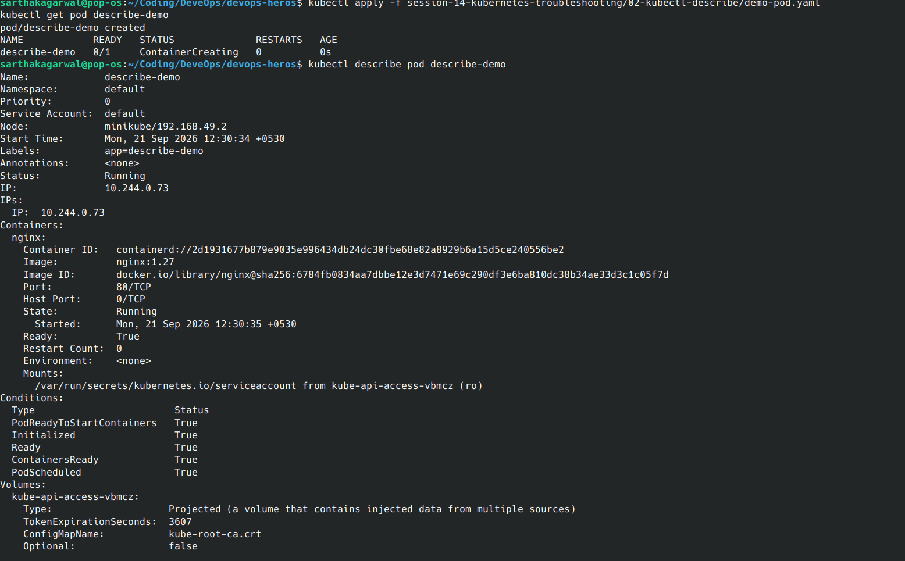
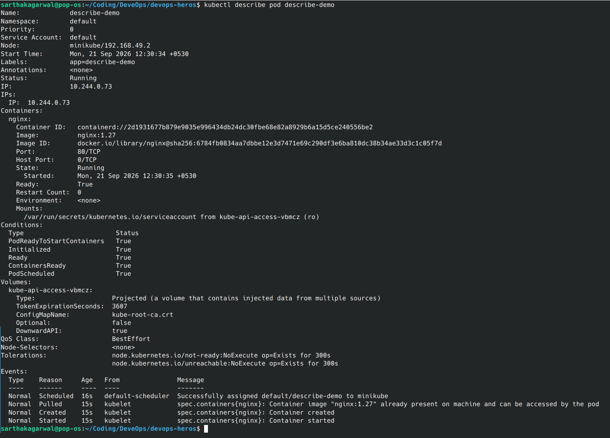
<!-- Paste the screenshot showing kubectl describe output here. -->

<br><br><br>

## 3. Read Container Logs

Create the logging Pod:

```bash
kubectl apply -f session-14-kubernetes-troubleshooting/03-kubectl-logs/pod.yaml
kubectl get pod logs-demo
```

Read the logs and follow new log messages:

```bash
kubectl logs logs-demo
kubectl logs -f logs-demo
```

Press `Ctrl+C` to stop following the logs.

### Screenshot
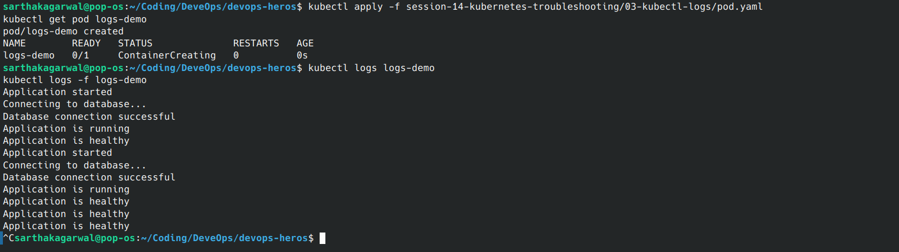
<!-- Paste the screenshot showing kubectl logs output here. -->

<br><br><br>

## 4. Run Commands with `kubectl exec`

Create the Pod:

```bash
kubectl apply -f session-14-kubernetes-troubleshooting/04-kubectl-exec/pod.yaml
kubectl get pod exec-demo
```

Run commands inside the container:

```bash
kubectl exec exec-demo -- hostname
kubectl exec exec-demo -- ls /usr/share/nginx/html
kubectl exec exec-demo -- cat /etc/hosts
kubectl exec -it exec-demo -- bash
```

Inside the container, run:

```bash
curl localhost
exit
```

### Screenshot
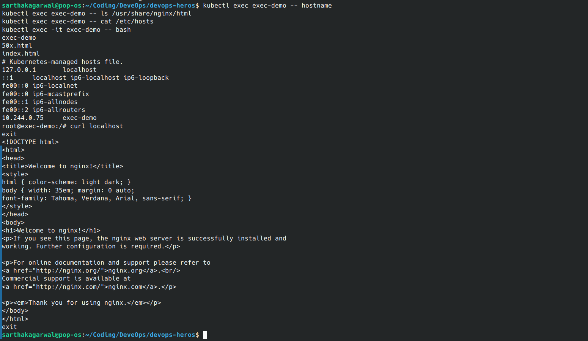
<!-- Paste the screenshot showing kubectl exec and the command run inside the container here. -->

<br><br><br>

## 5. Investigate Kubernetes Events

Create the Pod and inspect its events:

```bash
kubectl apply -f session-14-kubernetes-troubleshooting/05-events/pod.yaml
kubectl get events
kubectl get events --sort-by=.lastTimestamp
kubectl describe pod events-demo
```

Watch events in a separate terminal if supported by your `kubectl` version:

```bash
kubectl events --watch
```

### Screenshot
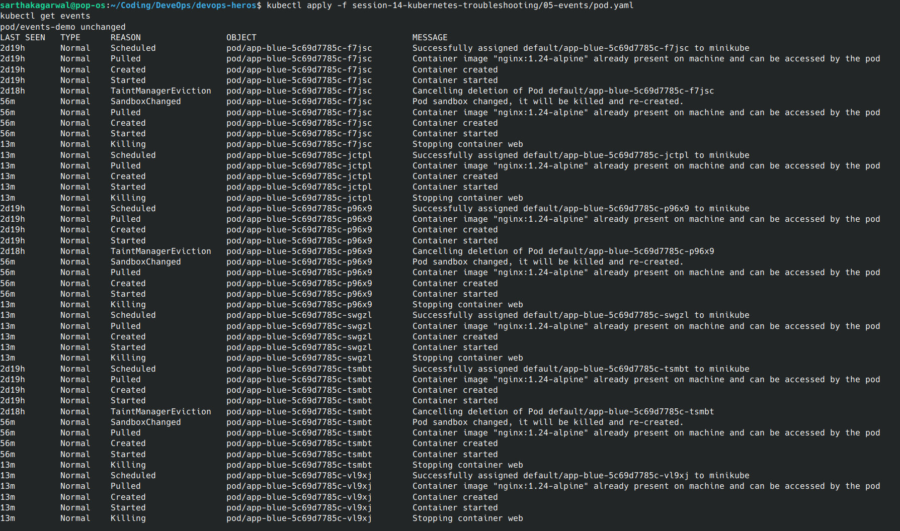
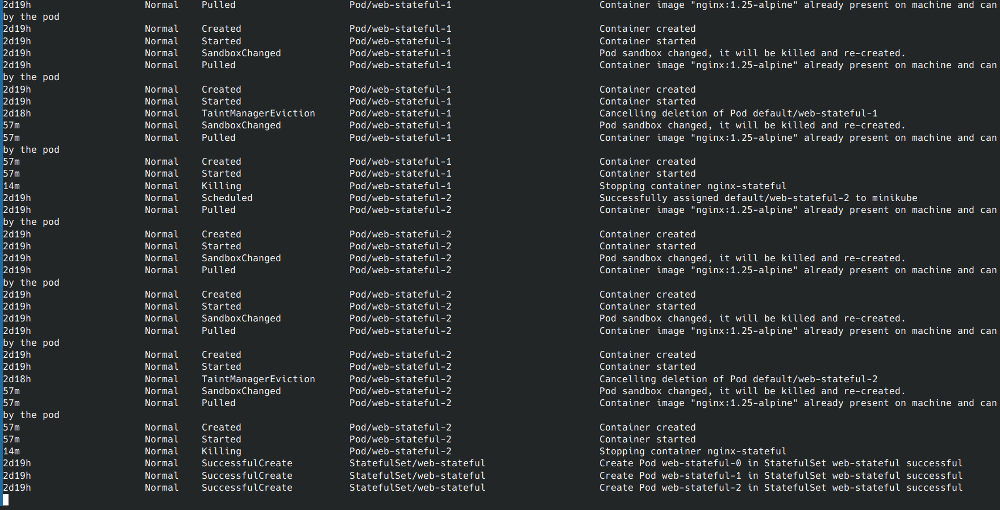

<!-- Paste the screenshot showing the Events output here. -->

<br><br><br>

## 6. Troubleshoot `CrashLoopBackOff`

Create the broken Pod:

```bash
kubectl apply -f session-14-kubernetes-troubleshooting/06-crashloopbackoff/broken-pod.yaml
kubectl get pod crash-demo
```

Investigate the status, events, and current and previous container logs:

```bash
kubectl describe pod crash-demo
kubectl logs crash-demo
kubectl logs crash-demo --previous
```

Fix the Pod:

```bash
kubectl delete pod crash-demo
kubectl apply -f session-14-kubernetes-troubleshooting/06-crashloopbackoff/fixed-pod.yaml
kubectl get pod crash-demo
kubectl logs crash-demo
```

### Screenshot

<!-- Paste the screenshot showing the broken status, investigation, and fixed status here. -->
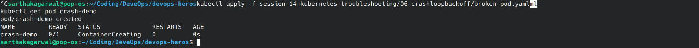
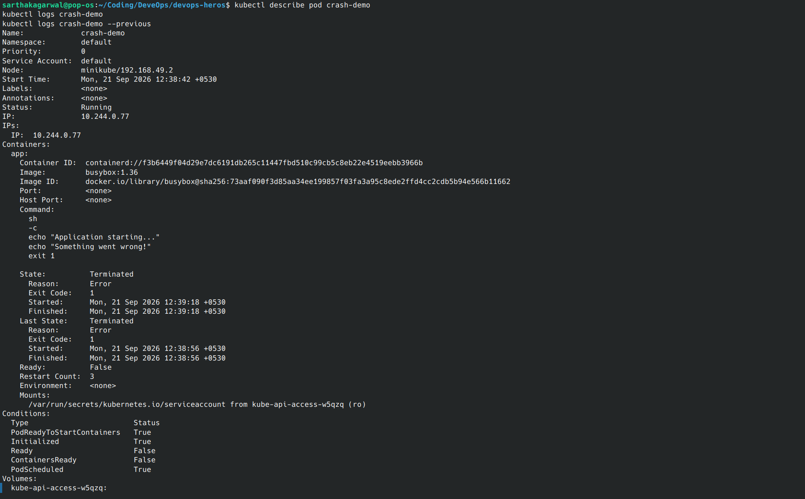
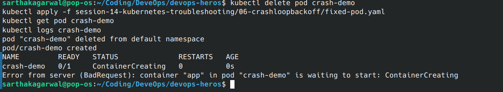

<br><br><br>

## 7. Troubleshoot `ImagePullBackOff`

Create the broken Pod:

```bash
kubectl apply -f session-14-kubernetes-troubleshooting/07-imagepullbackoff/broken-pod.yaml
kubectl get pod image-demo
kubectl describe pod image-demo
```

Use the `Events` section to identify the image error. Then apply the fixed image:

```bash
kubectl delete pod image-demo
kubectl apply -f session-14-kubernetes-troubleshooting/07-imagepullbackoff/fixed-pod.yaml
kubectl get pod image-demo
```

### Screenshot
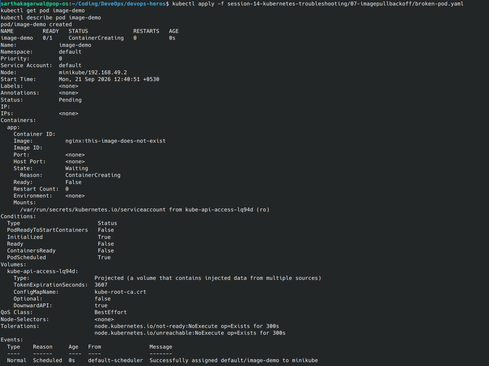
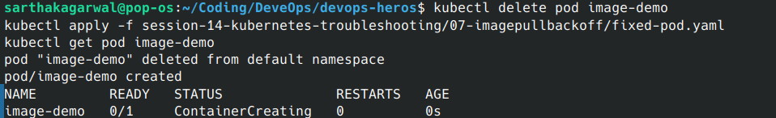

<!-- Paste the screenshot showing the image pull error and the fixed Pod here. -->

<br><br><br>

## 8. Troubleshoot a `Pending` Pod

Create the broken Pod:

```bash
kubectl apply -f session-14-kubernetes-troubleshooting/08-pending-pods/broken-pod.yaml
kubectl get pod pending-demo
kubectl describe pod pending-demo
kubectl get nodes
```

Use the events and node list to identify why the Pod cannot be scheduled. Then fix it:

```bash
kubectl delete pod pending-demo
kubectl apply -f session-14-kubernetes-troubleshooting/08-pending-pods/fixed-pod.yaml
kubectl get pod pending-demo
```

### Screenshot
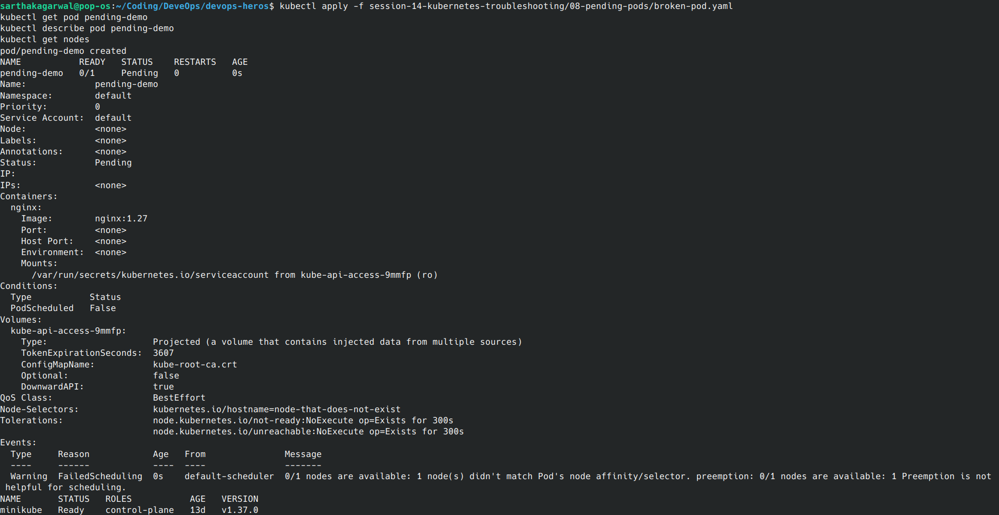
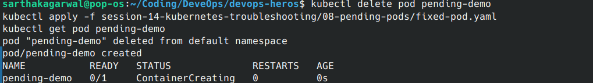

<!-- Paste the screenshot showing the Pending reason and the fixed Pod here. -->

<br><br><br>

## 9. Troubleshoot Service and DNS

Deploy the application and Service:

```bash
kubectl apply -f session-14-kubernetes-troubleshooting/09-service-dns-troubleshooting/deployment.yaml
kubectl apply -f session-14-kubernetes-troubleshooting/09-service-dns-troubleshooting/service.yaml
kubectl get pods
kubectl get service
kubectl describe service web-service
kubectl get endpoints web-service
```

Create the DNS test Pod and test the Service:

```bash
kubectl apply -f session-14-kubernetes-troubleshooting/09-service-dns-troubleshooting/dns-test-pod.yaml
kubectl get pod dns-test
kubectl exec -it dns-test -- nslookup web-service
kubectl exec -it dns-test -- nslookup web-service.default.svc.cluster.local
kubectl exec dns-test -- wget -qO- http://web-service
```

Break the Service selector and inspect the result:

```bash
kubectl apply -f session-14-kubernetes-troubleshooting/09-service-dns-troubleshooting/broken-service.yaml
kubectl get endpoints web-service
```

The endpoint list should show `<none>`. Restore the working Service:

```bash
kubectl apply -f session-14-kubernetes-troubleshooting/09-service-dns-troubleshooting/service.yaml
kubectl get endpoints web-service
```

### Screenshot

<!-- Paste the screenshot showing DNS resolution, Service connectivity, and the endpoint problem here. -->

<br><br><br>

## 10. Mini-Project Challenge

Deploy the application and Service:

```bash
kubectl apply -f session-14-kubernetes-troubleshooting/mini-project/deployment.yaml
kubectl apply -f session-14-kubernetes-troubleshooting/mini-project/service.yaml
kubectl get pods
kubectl get service
```

Inspect the application and Service:

```bash
kubectl get pods -o wide
kubectl describe pod <pod-name>
kubectl logs <pod-name>
kubectl exec -it <pod-name> -- bash
kubectl get endpoints troubleshooting-service
kubectl describe service troubleshooting-service
```

Create and investigate the intentionally broken Pod. Do not edit the YAML before finding the cause:

```bash
kubectl apply -f session-14-kubernetes-troubleshooting/mini-project/broken-pod.yaml
kubectl get pod project-broken-pod
kubectl describe pod project-broken-pod
```

Answer these questions in your assignment:

1. What is the Pod status?
2. What is the actual error?
3. Which command revealed the reason?
4. What is wrong with the image?
5. How would you fix it?

### Screenshot

<!-- Paste the screenshot showing the mini-project investigation here. -->

<br><br><br>

## Cleanup

Remove the resources created during the exercises:

```bash
kubectl delete pod get-demo describe-demo logs-demo exec-demo events-demo crash-demo image-demo pending-demo dns-test project-broken-pod --ignore-not-found
kubectl delete -f session-14-kubernetes-troubleshooting/09-service-dns-troubleshooting/deployment.yaml --ignore-not-found
kubectl delete -f session-14-kubernetes-troubleshooting/09-service-dns-troubleshooting/service.yaml --ignore-not-found
kubectl delete -f session-14-kubernetes-troubleshooting/mini-project/deployment.yaml --ignore-not-found
kubectl delete -f session-14-kubernetes-troubleshooting/mini-project/service.yaml --ignore-not-found
```

### Final Screenshot

<!-- Paste the screenshot showing the cleanup command and final cluster state here. -->

<br><br><br>
