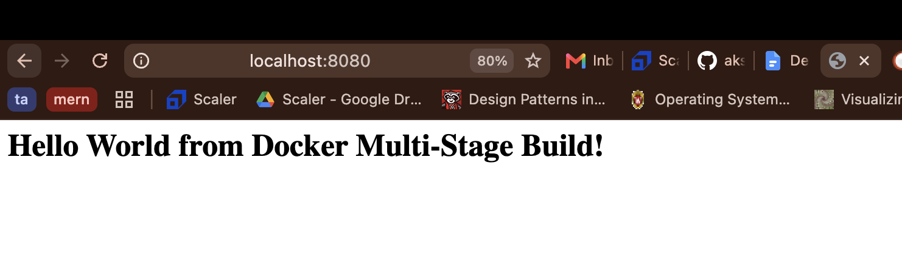
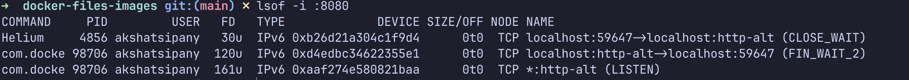
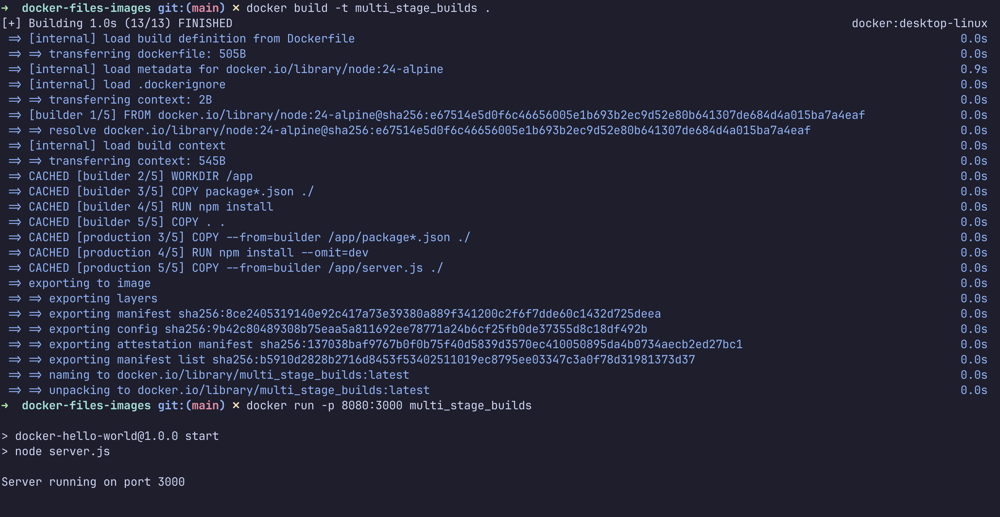
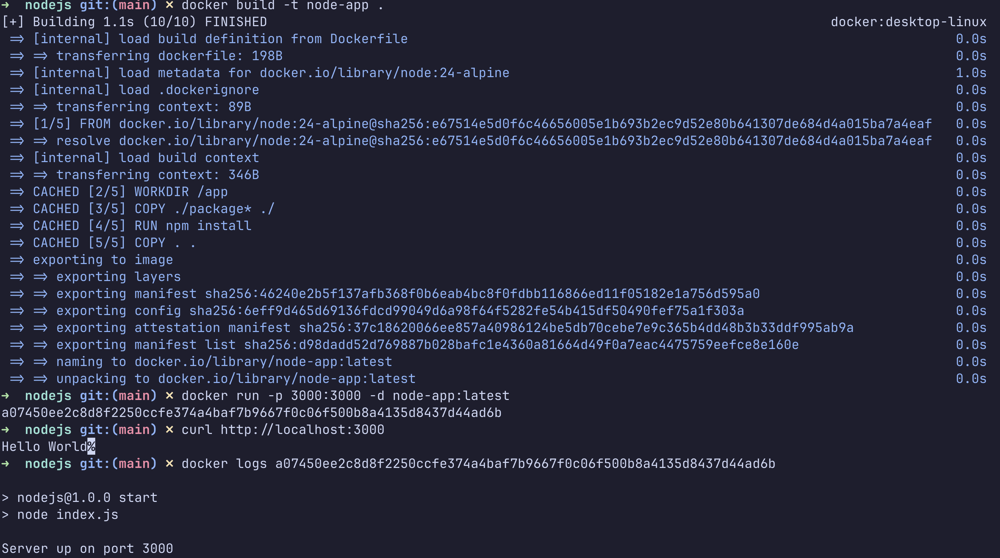

# Docker Multi-Stage Builds & Container Deployment

This repository documents the execution and verification of multi-stage Docker builds along with containerized deployments across diverse tech stacks.

## Task 1: Multi-Stage Build Implementation

A multi-stage Docker setup was constructed for a Node.js web server to separate the build pipeline from the production runtime, significantly reducing final image footprint.

### Step 1: Building the Docker Image

Execute the build command to generate the optimized container image:

```bash
docker build -t multi_stage_builds .
```

### Step 2: Launching the Container

Deploy the container background process, exposing the internal port `3000` to port `8080` on the host machine:

```bash
docker run -p 8080:3000 -d multi_stage_builds
```

### Step 3: Application Health Verification

Confirm service availability by issuing an HTTP GET request to [http://localhost:8080](http://localhost:8080) or executing `curl`:

```bash
curl http://localhost:8080
```

Expected HTTP Response Body:

```html
<h1>Hello World from Docker Multi-Stage Build!</h1>
```



### Step 4: Container Port Mapping Audit

Inspect active containers to verify port bindings and state:

```bash
docker ps
```

The container maps incoming requests on `0.0.0.0:8080` directly to container target `3000/tcp`.




### Build Phase Evidence



---

## Task 3: Multi-Language Containerized Deployments

Three containerized services built on distinct runtimes were instantiated and validated:

| Environment | Image Name | Container Port | Published Host Port | Validation Command & Result |
| :--- | :--- | :---: | :---: | :--- |
| **Node.js Express** | `node-app` | 3000 | 3000 | `curl http://localhost:3000` returns `Hello World` |
| **Python FastAPI** | `python-app` | 8000 | 8000 | `curl http://localhost:8000/` returns JSON status payload |
| **Java Spring Boot** | `java-app` | 8080 | 8080 | `curl http://localhost:8080/` returns text response `Hello World` |

### Service Validation Logs

#### Node.js Application Status



#### Python FastAPI Status


#### Java Spring Boot Status


