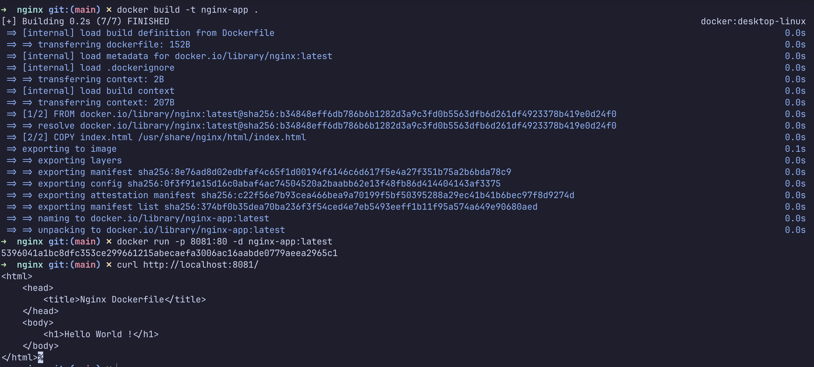
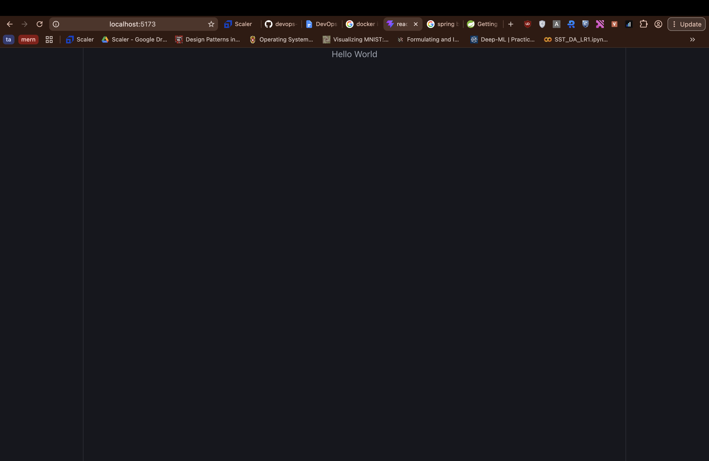
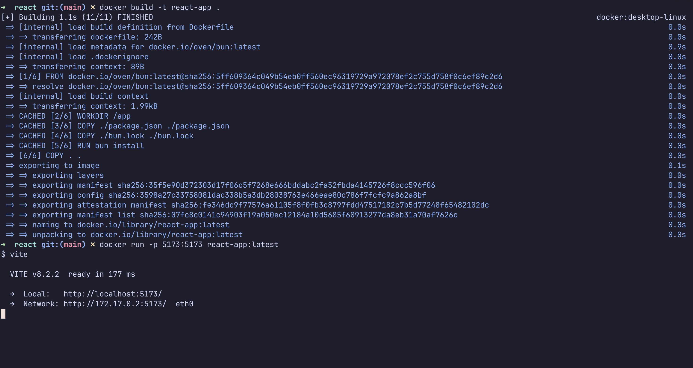

# Docker Fundamentals: Containerizing Web Applications

This document details the containerization process for six distinct application technology stacks using Dockerfiles. Each micro-service is built into a standalone Docker image and executed within an isolated container environment.

## Project Structure Overview

```text
docker-fundamentals/
├── apache/         # Apache HTTP Web Server setup
├── java/           # Java Spring Boot application
├── nginx/          # NGINX lightweight Web Server
├── nodejs/         # Node.js Express server
├── python/         # Python FastAPI service
├── react/          # React Vite frontend application
└── screenshots/    # Terminal and browser validation captures
```

## Service Port Configuration

| Application Framework | Directory | Container Listening Port | Mapped Host Port |
| :--- | :--- | :---: | :---: |
| **Node.js Express** | `nodejs/` | 3000 | 3000 |
| **Python FastAPI** | `python/` | 8000 | 8000 |
| **Java Spring Boot** | `java/` | 8080 | 8080 |
| **Apache HTTP Server** | `apache/` | 80 | 8080 |
| **React (Vite)** | `react/` | 5173 | 5173 |
| **NGINX Web Server** | `nginx/` | 80 | 8081 |

---

## Build & Execution Instructions

Navigate to `assignments/docker-fundamentals` prior to running the commands below.

### 1. Node.js Service

```bash
cd nodejs
docker build -t node-app .
docker run --name node-app -p 3000:3000 -d node-app
curl http://localhost:3000
cd ..
```

*Expected API Response:* `Hello World`

### 2. Python FastAPI Service

```bash
cd python
docker build -t python-app .
docker run --name python-app -p 8000:8000 -d python-app
curl http://localhost:8000
cd ..
```

*Expected API Response:* `{"status":"OK","message":"Hello World"}`

### 3. Java Spring Boot Application

Compile the application artifact via Gradle before invoking Docker build:

```bash
cd java
./gradlew bootJar
docker build -t java-app .
docker run --name java-app -p 8080:8080 -d java-app
curl http://localhost:8080
cd ..
```

*Expected Endpoint Output:* `Hello World`

### 4. Apache HTTP Server

```bash
cd apache
docker build -t apache-app .
docker run --name apache-app -p 8080:80 -d apache-app
curl http://localhost:8080
cd ..
```

*Expected HTML Header:* `Hello World !`

### 5. React Frontend App

```bash
cd react
docker build -t react-app .
docker run --name react-app -p 5173:5173 -d react-app
open http://localhost:5173
cd ..
```

*Expected Browser Content:* `Hello World`

### 6. NGINX Web Server

```bash
cd nginx
docker build -t nginx-app .
docker run --name nginx-app -p 8081:80 -d nginx-app
curl http://localhost:8081
cd ..
```

*Expected HTML Header:* `Hello World !`

---

## Deployment Verification Screenshots

### Apache HTTP Server


### Java Spring Boot


### NGINX Server



### Node.js Express


### Python FastAPI


### React Frontend UI & Terminal



