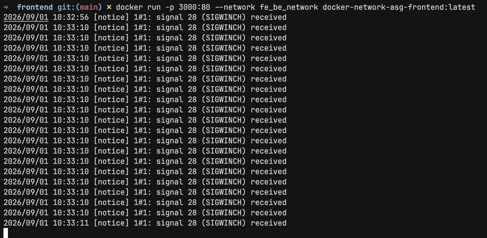
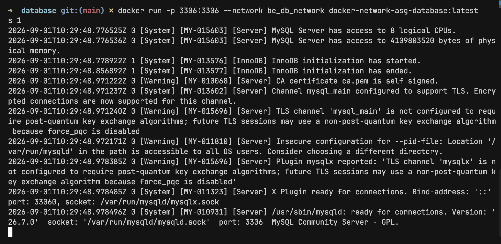
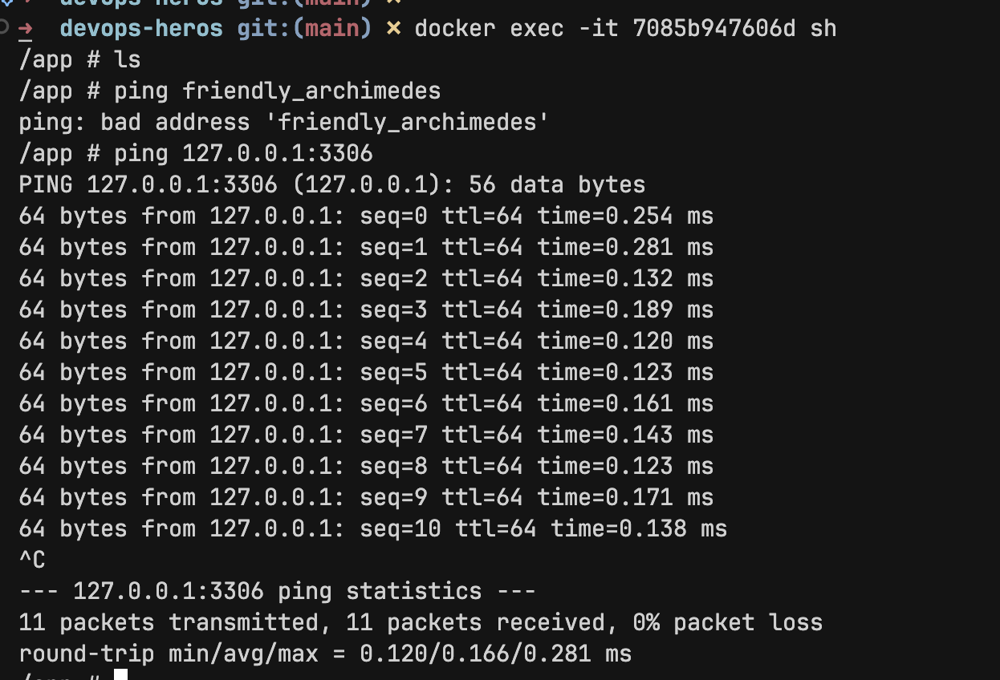
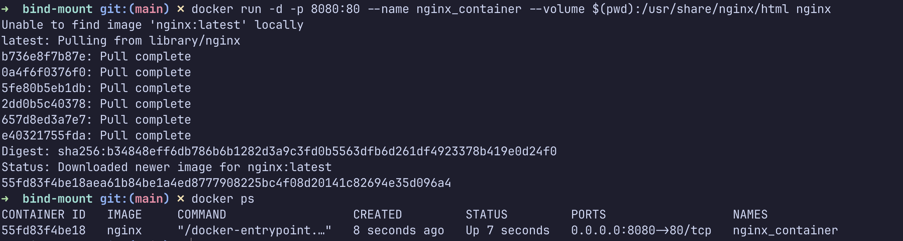
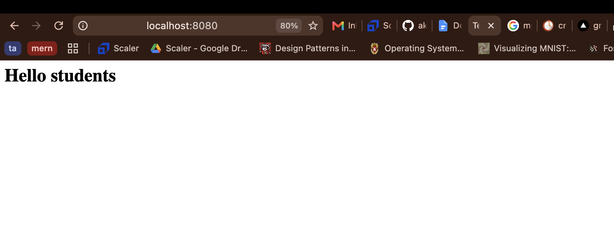

# Container Networking & Storage Volume Operations

This document covers custom Docker network drivers, container communication isolation, host networking, local bind mounts, and distributed overlay networking concepts.

---

## Task 1: Multi-Tier Custom Container Networks

This practical exercise configures custom Docker bridge networks to manage isolated communications between frontend, backend microservice, and database containers.

### 1. Custom Network Initialization

Initialize custom bridge networks to isolate application layers:

### 2. Frontend Container Deployment

Building the frontend service container image:

Instantiating and executing the frontend container:

### 3. Backend Microservice Deployment

Building the backend API container image:

Running the backend API container:

### 4. Database Tier Deployment

Building the database container image:

Running the database service container:

### 5. Multi-Network Attachment & Verification

Attaching the backend service to both frontend and database networks to facilitate proxying:

Testing cross-container ping and resolution capabilities:

---

## Task 2: Host Network Driver Configuration

When running containers using `--network host`, the container shares the host machine's networking stack directly without network port mapping or IP virtualization.

### Image Retrieval

### Container Execution on Host Network

---

## Task 3: Storage Persistency & Bind Mounts

Bind mounts map a specific host directory directly into a container path, enabling real-time file synchronization without requiring image rebuilding.

### 1. Initializing Container with Local Bind Mount

### 2. Live Page Verification

### 3. Real-Time Content Modification

Updating host source files immediately reflects inside the running container without restarting the service:

---

## Task 4: Docker Overlay Network Architecture & Deep Dive

Overlay networks establish a distributed, virtual subnet across multiple independent Docker host machines. While single-host bridge networks are bounded to a single engine daemon, overlay networks leverage VXLAN encapsulation so containers running on distinct host nodes interact as if connected to the same physical switch.

### Key Operational Use Cases

- Multi-host microservices deployment running across cloud infrastructure or hybrid data centers.
- Docker Swarm and cluster orchestrations needing native service discovery and internal load balancing.
- Secure container-to-container communication with optional IPsec encryption over public or untrusted physical networks.
- Decoupling application deployment topologies from underlying physical network infrastructure.

### How Overlay Networks Function

1. **Virtual Network Layer:** Docker creates a overlay-specific network bridge interface on each cluster host node.
2. **VXLAN Encapsulation:** Traffic originating from a container destined for a remote node is wrapped inside standard UDP packets (port 4789).
3. **Internal DNS & Discovery:** Docker daemon's embedded DNS server dynamically resolves container and service aliases across all participating hosts.
4. **Transparent Communication:** Containers send standard IP packets, unaware that data packets are being tunneled across physical host boundaries.

### Core Takeaways

- Overlay networks enable transparent cross-host networking without static routing rules on physical hardware.
- Fully integrated into Docker Engine and Docker Swarm for zero-downtime microservices connectivity.
- Provides cryptographic network segmentation for multi-tenant container workloads.

