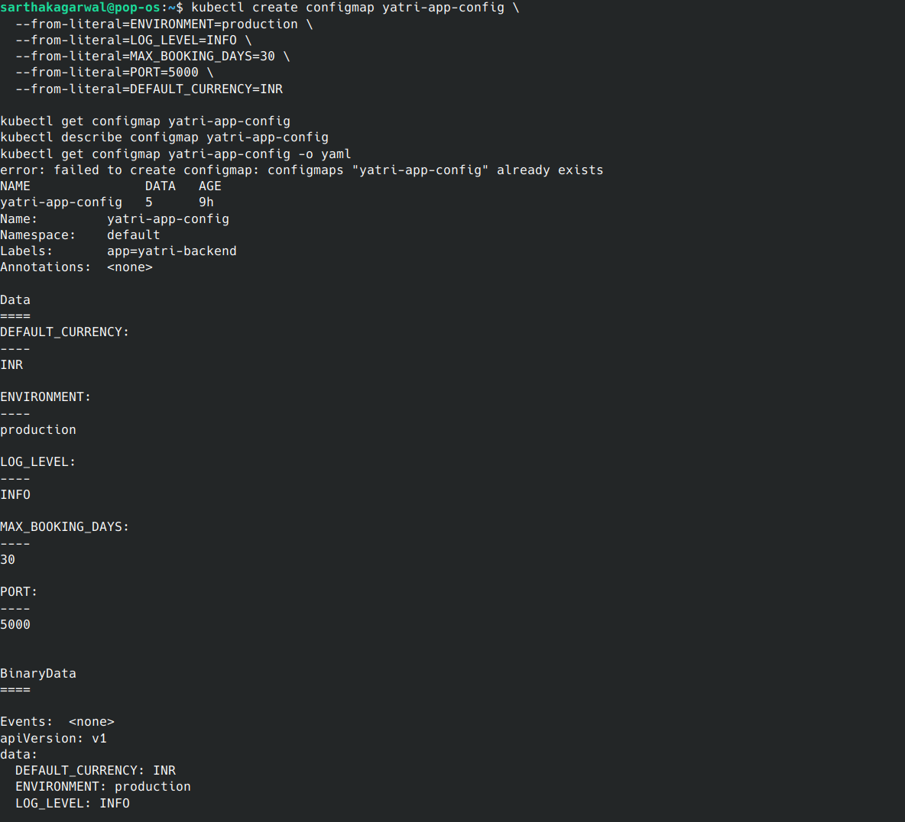
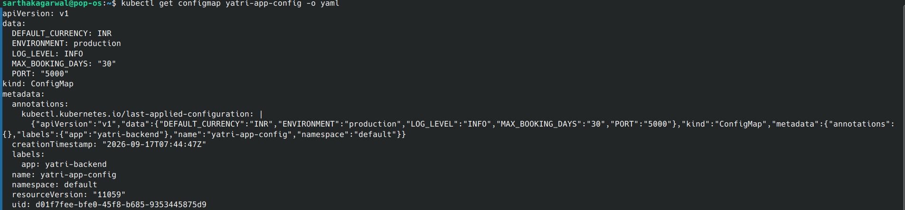
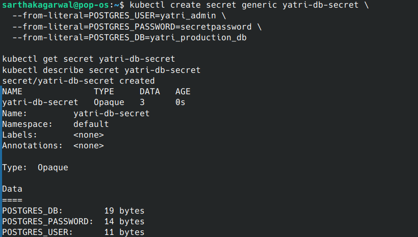
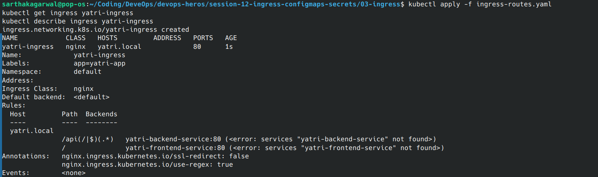
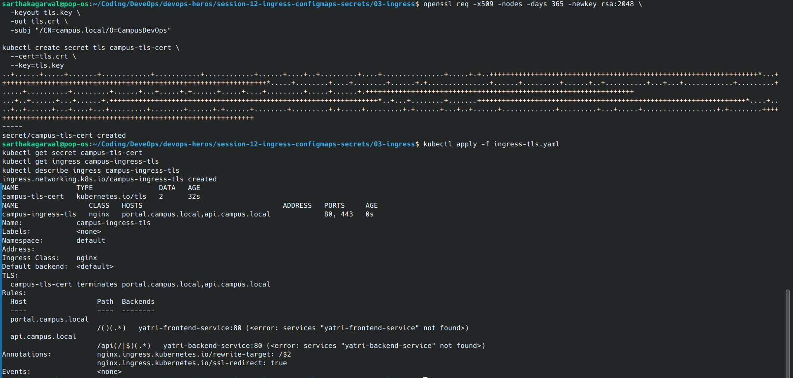

# Kubernetes Ingress, ConfigMaps and Secrets

This assignment demonstrates how to create and verify Kubernetes ConfigMaps, Secrets, Ingress routes, and TLS configuration.

## Topics Covered

- Creating and inspecting a ConfigMap
- Reading ConfigMap values with `jsonpath`
- Creating and decoding Kubernetes Secrets
- Configuring Ingress routes
- Creating a TLS Secret
- Configuring HTTPS Ingress

## 1. ConfigMap

Create a ConfigMap with application configuration values:

```bash
kubectl create configmap yatri-app-config \
  --from-literal=ENVIRONMENT=production \
  --from-literal=LOG_LEVEL=INFO \
  --from-literal=MAX_BOOKING_DAYS=30 \
  --from-literal=PORT=5000 \
  --from-literal=DEFAULT_CURRENCY=INR

kubectl get configmap yatri-app-config
kubectl describe configmap yatri-app-config
kubectl get configmap yatri-app-config -o yaml
```

Read a ConfigMap value with `jsonpath`:

```bash
kubectl get configmap yatri-app-config \
  -o jsonpath='{.data.LOG_LEVEL}'
echo
```




## 2. Secret

Create a Secret containing PostgreSQL credentials:

```bash
kubectl create secret generic yatri-db-secret \
  --from-literal=POSTGRES_USER=yatri_admin \
  --from-literal=POSTGRES_PASSWORD=secretpassword \
  --from-literal=POSTGRES_DB=yatri_production_db

kubectl get secret yatri-db-secret
kubectl describe secret yatri-db-secret
```

Secret values are Base64 encoded. Base64 is encoding, not encryption.

```bash
kubectl get secret yatri-db-secret \
  -o jsonpath='{.data.POSTGRES_PASSWORD}' | base64 --decode
echo
```




## 3. Ingress Routes

Install an Ingress Controller, such as the NGINX Ingress Controller, before creating an Ingress resource.

The example routes requests for `yatri.local`:

- `/` routes to the frontend Service.
- `/api` routes to the backend Service.

Apply your Ingress manifest:

```bash
kubectl apply -f ingress-routes.yaml
kubectl get ingress yatri-ingress
kubectl describe ingress yatri-ingress
```



## 4. TLS Ingress

Generate a self-signed certificate and create a TLS Secret:

```bash
openssl req -x509 -nodes -days 365 -newkey rsa:2048 \
  -keyout tls.key \
  -out tls.crt \
  -subj "/CN=campus.local/O=CampusDevOps"

kubectl create secret tls campus-tls-cert \
  --cert=tls.crt \
  --key=tls.key
```

Apply your TLS Ingress manifest:

```bash
kubectl apply -f ingress-tls.yaml
kubectl get secret campus-tls-cert
kubectl get ingress campus-ingress-tls
kubectl describe ingress campus-ingress-tls
```

The TLS Ingress serves:

- `portal.campus.local`
- `api.campus.local`



## Important Notes

- Use `echo -n` when Base64 encoding Secret values to avoid adding a newline.
- ConfigMaps are intended for non-sensitive configuration.
- Secrets should be protected with appropriate RBAC permissions.
- Kubernetes Secrets use Base64 encoding by default; they are not automatically encrypted.
- Do not commit `tls.key` or other private credentials to the repository.

## Cleanup

```bash
kubectl delete configmap yatri-app-config
kubectl delete secret yatri-db-secret campus-tls-cert
kubectl delete -f ingress-routes.yaml
kubectl delete -f ingress-tls.yaml
rm -f tls.key tls.crt
```
