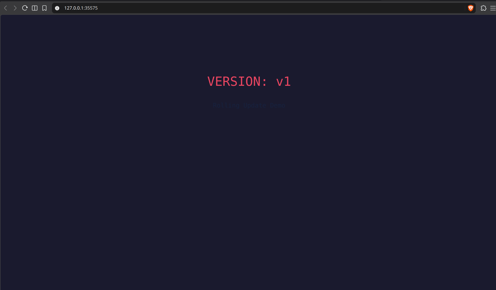
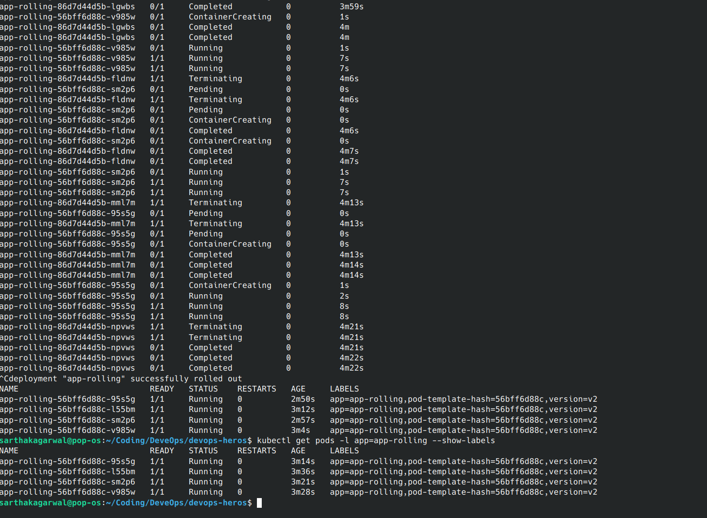
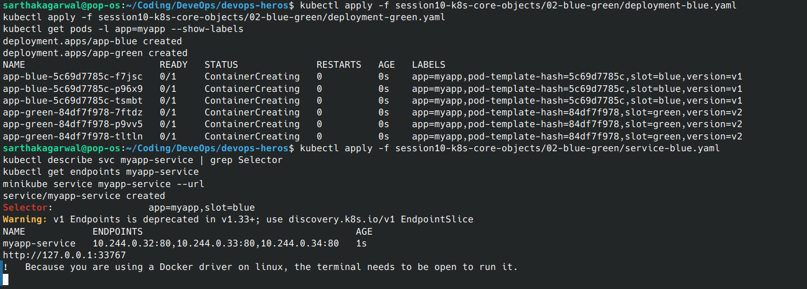
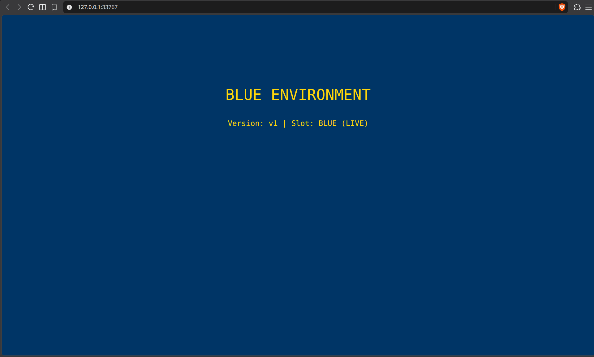
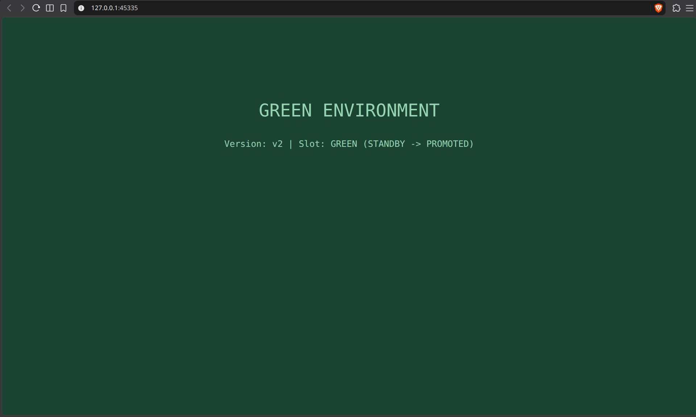
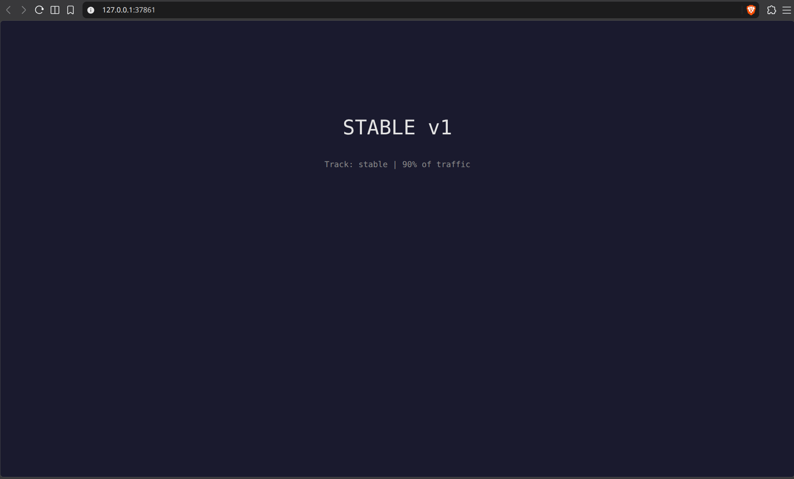
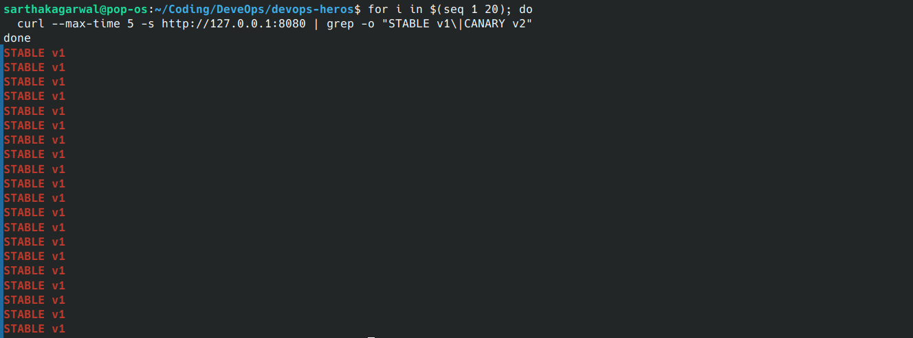
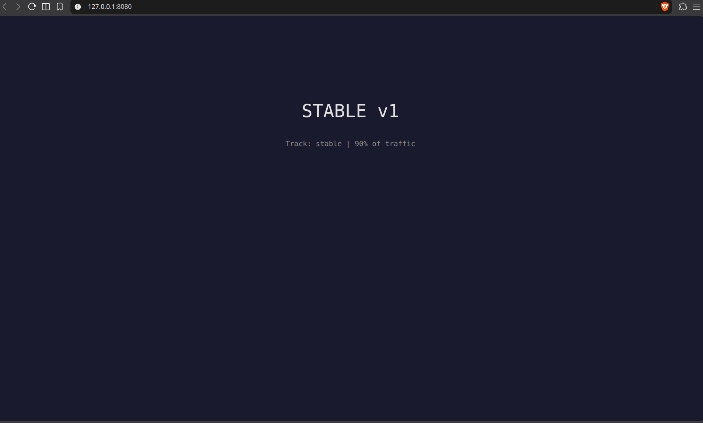
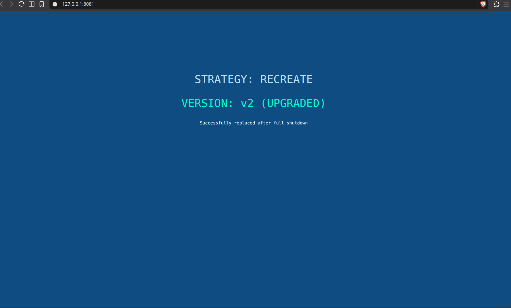

# Kubernetes Deployment Strategies

This assignment demonstrates four Kubernetes Deployment strategies using Minikube:

1. Rolling update
2. Blue-green deployment
3. Canary deployment
4. Recreate deployment

Each example uses an NGINX page that displays the active application version, making the deployment behavior visible in a browser or with `curl`.

The commands below are run from the repository root. The manifests are stored in `session10-k8s-core-objects`.

## 1. Rolling Update

A rolling update replaces Pods gradually while keeping the application available. This example runs four replicas with `maxSurge: 1` and `maxUnavailable: 0`.

### Deploy version 1

```bash
kubectl apply -f session10-k8s-core-objects/01-rolling-update/deployment-v1.yaml
kubectl apply -f session10-k8s-core-objects/01-rolling-update/service.yaml
kubectl rollout status deployment/app-rolling
kubectl get pods -l app=app-rolling --show-labels
```



Access the application through the NodePort Service:

```bash
minikube service app-rolling-service --url
```

### Update to version 2

```bash
kubectl apply -f session10-k8s-core-objects/01-rolling-update/deployment-v2.yaml
kubectl get pods -l app=app-rolling -w
kubectl rollout status deployment/app-rolling
kubectl get pods -l app=app-rolling --show-labels
```

During the rollout, old v1 Pods are terminated as new v2 Pods become ready. The Service remains available.



Check rollout history and rollback:

```bash
kubectl rollout history deployment/app-rolling
kubectl rollout undo deployment/app-rolling
kubectl rollout status deployment/app-rolling
```

## 2. Blue-Green Deployment

Blue-green deployment runs two versions at the same time. The Service selector determines which environment receives traffic. Blue is v1 and Green is v2.

### Deploy both environments

```bash
kubectl apply -f session10-k8s-core-objects/02-blue-green/deployment-blue.yaml
kubectl apply -f session10-k8s-core-objects/02-blue-green/deployment-green.yaml
kubectl get pods -l app=myapp --show-labels
```



### Send traffic to Blue

```bash
kubectl apply -f session10-k8s-core-objects/02-blue-green/service-blue.yaml
kubectl describe svc myapp-service | grep Selector
kubectl get endpoints myapp-service
minikube service myapp-service --url
```

The selector is `app=myapp,slot=blue`, and the browser shows the Blue v1 environment.



### Switch traffic to Green

```bash
kubectl apply -f session10-k8s-core-objects/02-blue-green/service-green.yaml
kubectl describe svc myapp-service | grep Selector
kubectl get endpoints myapp-service
```

The Service selector changes to `app=myapp,slot=green`, switching all traffic to Green v2. Roll back by applying `service-blue.yaml` again:



```bash
kubectl apply -f session10-k8s-core-objects/02-blue-green/service-blue.yaml
```

## 3. Canary Deployment

A canary deployment sends a small portion of traffic to a new version before full promotion. This example uses nine stable v1 Pods and one canary v2 Pod, producing an approximate 90/10 split.

### Deploy the stable version and Service

```bash
kubectl apply -f session10-k8s-core-objects/03-canary/deployment-stable.yaml
kubectl rollout status deployment/app-stable
kubectl apply -f session10-k8s-core-objects/03-canary/service.yaml
```



Test the stable version:

```bash
for i in $(seq 1 10); do curl -s http://$(minikube ip):30030 | grep -o "STABLE v1\\|CANARY v2"; done
```

### Add the canary version

```bash
kubectl apply -f session10-k8s-core-objects/03-canary/deployment-canary.yaml
kubectl get pods -l app=myapp-canary --show-labels
kubectl get endpoints myapp-canary-service
```

Test the approximate traffic split:

```bash
for i in $(seq 1 20); do curl -s http://$(minikube ip):30030 | grep -o "STABLE v1\\|CANARY v2"; done
```

Increase the canary to 30%:



```bash
kubectl scale deployment app-canary --replicas=3
kubectl scale deployment app-stable --replicas=7
kubectl get endpoints myapp-canary-service
```

Promote the canary or roll it back:

```bash
# Promote to 100% canary traffic
kubectl scale deployment app-canary --replicas=9
kubectl scale deployment app-stable --replicas=0

# Roll back to stable traffic
kubectl scale deployment app-canary --replicas=0
kubectl scale deployment app-stable --replicas=9
```

The Kubernetes-native traffic split is approximate because it is based on the ratio of matching Pod endpoints. Precise weighted routing requires an Ingress Controller or a progressive delivery tool.

## 4. Recreate Deployment

The Recreate strategy terminates all old Pods before creating the new Pods. It causes a short period of downtime but prevents v1 and v2 from running simultaneously.

### Deploy version 1

```bash
kubectl apply -f session10-k8s-core-objects/04-recreate/deployment-v1.yaml
kubectl apply -f session10-k8s-core-objects/04-recreate/service.yaml
kubectl get pods -l app=app-recreate
curl http://localhost:30040
```



### Update to version 2

In a second terminal, watch the Pods while applying the new Deployment:

```bash
kubectl get pods -l app=app-recreate -w
```

```bash
kubectl apply -f session10-k8s-core-objects/04-recreate/deployment-v2.yaml
kubectl rollout status deployment/app-recreate
curl http://localhost:30040
```

The old Pods terminate first, followed by a temporary period with no running Pods. The new v2 Pods then start and restore the Service.



Rollback if required:

```bash
kubectl rollout undo deployment/app-recreate
kubectl rollout status deployment/app-recreate
```

## Strategy Comparison

| Strategy | Downtime | Traffic behavior | Resource use | Best suited for |
| --- | --- | --- | --- | --- |
| Rolling update | No planned downtime | Gradually moves from old to new Pods | Low to moderate | Stateless applications and normal releases |
| Blue-green | No planned downtime | Switches all traffic between environments | High, because both versions run | Fast cutover and instant rollback |
| Canary | No planned downtime | Sends an approximate percentage to the new version | Moderate | Testing a release with limited user exposure |
| Recreate | Yes | Stops all old Pods before starting new Pods | Low | Incompatible versions, RWO storage, or planned maintenance |

## Cleanup

```bash
kubectl delete -f session10-k8s-core-objects/01-rolling-update/service.yaml
kubectl delete -f session10-k8s-core-objects/01-rolling-update/deployment-v1.yaml
kubectl delete -f session10-k8s-core-objects/02-blue-green/service-blue.yaml
kubectl delete -f session10-k8s-core-objects/02-blue-green/deployment-blue.yaml
kubectl delete -f session10-k8s-core-objects/02-blue-green/deployment-green.yaml
kubectl delete -f session10-k8s-core-objects/03-canary/service.yaml
kubectl delete -f session10-k8s-core-objects/03-canary/deployment-canary.yaml
kubectl delete -f session10-k8s-core-objects/03-canary/deployment-stable.yaml
kubectl delete -f session10-k8s-core-objects/04-recreate/service.yaml
kubectl delete -f session10-k8s-core-objects/04-recreate/deployment-v2.yaml
```

## Reference Guides

- [Rolling update guide](../../session10-k8s-core-objects/01-rolling-update/README.md)
- [Blue-green guide](../../session10-k8s-core-objects/02-blue-green/README.md)
- [Canary guide](../../session10-k8s-core-objects/03-canary/README.md)
- [Recreate guide](../../session10-k8s-core-objects/04-recreate/README.md)
