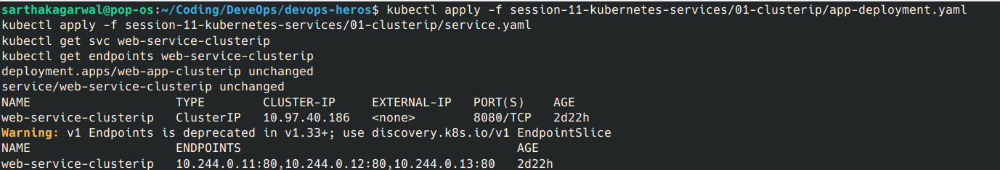
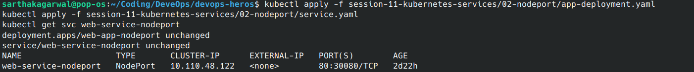
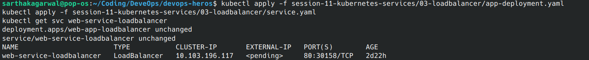
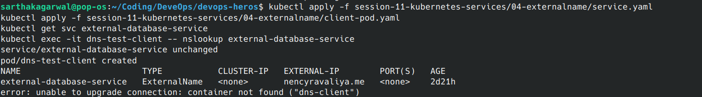
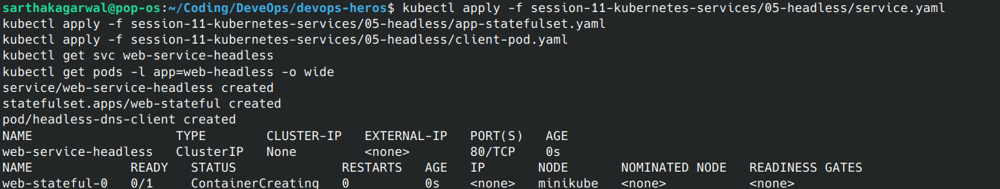
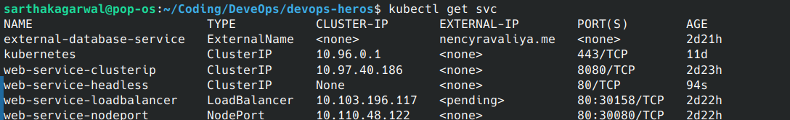

# Kubernetes Services Lab

This assignment demonstrates the five commonly used Kubernetes Service types:

- `ClusterIP` for communication inside the cluster
- `NodePort` for exposing an application through a worker node port
- `LoadBalancer` for exposing an application through a cloud load balancer
- `ExternalName` for creating a DNS alias to an external service
- Headless Service for discovering individual Pod IP addresses

## Deploy the Services

Run the examples one at a time from the repository root.

### 1. ClusterIP

ClusterIP is the default Service type. It provides a stable virtual IP and DNS name that can be accessed from inside the cluster.

```bash
kubectl apply -f session-11-kubernetes-services/01-clusterip/app-deployment.yaml
kubectl apply -f session-11-kubernetes-services/01-clusterip/service.yaml
kubectl get svc web-service-clusterip
kubectl get endpoints web-service-clusterip
```



### 2. NodePort

NodePort exposes the application on a port on every worker node. In this example, the application is available on port `30080`.

```bash
kubectl apply -f session-11-kubernetes-services/02-nodeport/app-deployment.yaml
kubectl apply -f session-11-kubernetes-services/02-nodeport/service.yaml
kubectl get svc web-service-nodeport
```

The port mapping is shown as `80:30080/TCP`, where `80` is the Service port and `30080` is the node port.



### 3. LoadBalancer

LoadBalancer requests an external load balancer from the cloud provider. On a local cluster, the external address may remain `<pending>`.

```bash
kubectl apply -f session-11-kubernetes-services/03-loadbalancer/app-deployment.yaml
kubectl apply -f session-11-kubernetes-services/03-loadbalancer/service.yaml
kubectl get svc web-service-loadbalancer
```



### 4. ExternalName

ExternalName creates a DNS CNAME alias to an external hostname. It does not create a ClusterIP or select Pods.

```bash
kubectl apply -f session-11-kubernetes-services/04-externalname/service.yaml
kubectl apply -f session-11-kubernetes-services/04-externalname/client-pod.yaml
kubectl get svc external-database-service
kubectl exec -it dns-test-client -- nslookup external-database-service
```



### 5. Headless Service

A headless Service sets `clusterIP: None`. DNS returns the addresses of the matching Pods instead of one virtual IP.

```bash
kubectl apply -f session-11-kubernetes-services/05-headless/service.yaml
kubectl apply -f session-11-kubernetes-services/05-headless/app-statefulset.yaml
kubectl apply -f session-11-kubernetes-services/05-headless/client-pod.yaml
kubectl get svc web-service-headless
kubectl get pods -l app=web-headless -o wide
```



## Final Verification

After applying all five examples, list every Service in the namespace:

```bash
kubectl get svc
```

The final output showed the following Service types:




The IP addresses, assigned NodePort, external address, and resource ages can change each time the resources are created. The important verification is that each Service has the expected type and port configuration.

## Cleanup

Remove the resources after completing the lab:

```bash
kubectl delete -f session-11-kubernetes-services/01-clusterip/
kubectl delete -f session-11-kubernetes-services/02-nodeport/
kubectl delete -f session-11-kubernetes-services/03-loadbalancer/
kubectl delete -f session-11-kubernetes-services/04-externalname/
kubectl delete -f session-11-kubernetes-services/05-headless/
```

## Reference

See the detailed explanations in [`session-11-kubernetes-services/service.md`](../../session-11-kubernetes-services/service.md).
