# Session 13: Kubernetes Storage, HPA, and Probes Assignment

### `kubectl get pods` Screenshot

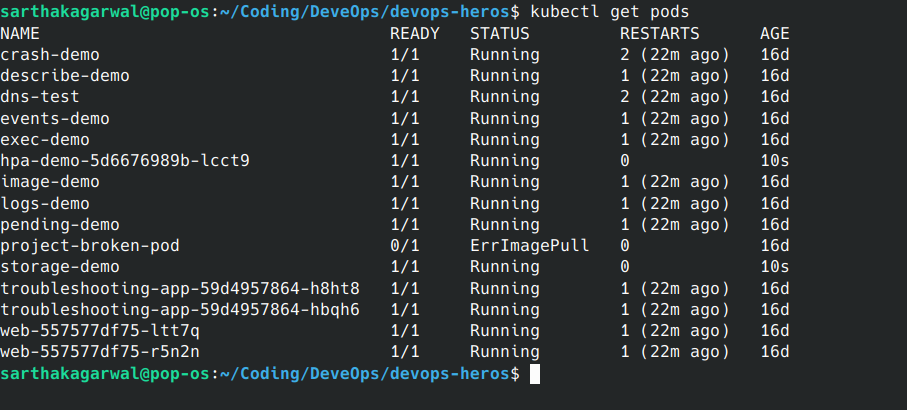

<br><br><br>

### `kubectl get all` Screenshot

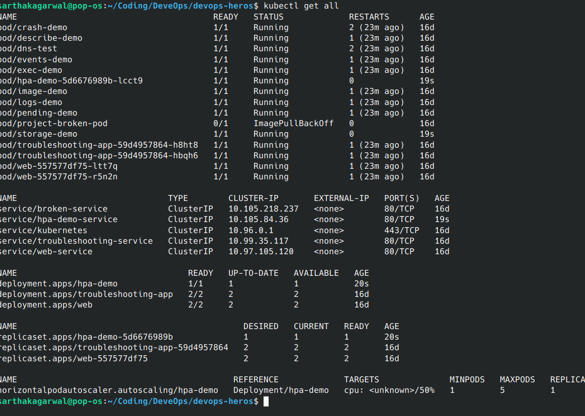

<br><br><br>

Work through the exercises in order. Run the commands from the repository root:


---

## Prerequisites

- A running Kubernetes cluster (e.g., Minikube)
- `kubectl` configured for the cluster
- Metrics Server enabled (`minikube addons enable metrics-server`)
- Default StorageClass enabled (`minikube addons enable default-storageclass`)

Check the cluster connection and nodes:

```bash
kubectl cluster-info
kubectl get nodes
```

### Screenshot

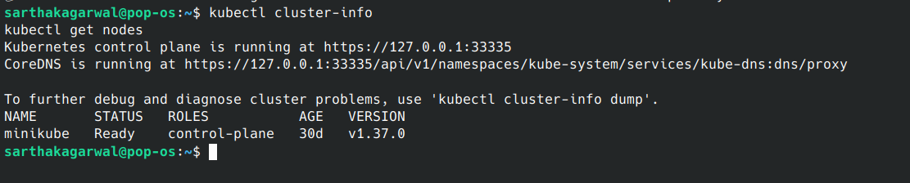

<br><br><br>

---

## 1. Basic Kubernetes Volumes (`emptyDir` and `hostPath`)

### Part A: Ephemeral Storage with `emptyDir`

Apply the `emptyDir` demo Pod:

```bash
kubectl apply -f session-13-storage-hpa-probes/01-volumes/emptydir-pod.yaml
kubectl get pods
```

Enter the container and create a file inside `/data`:

```bash
kubectl exec -it emptydir-demo -- bash
```

Inside the container, run:

```bash
echo "Hello Kubernetes" > /data/message.txt
cat /data/message.txt
exit
```

Delete the Pod and recreate it to verify that `emptyDir` storage is ephemeral and tied to the Pod lifecycle:

```bash
kubectl delete pod emptydir-demo
kubectl apply -f session-13-storage-hpa-probes/01-volumes/emptydir-pod.yaml
kubectl get pods
kubectl exec emptydir-demo -- cat /data/message.txt
```

Expected output:
```text
cat: /data/message.txt: No such file or directory
```

### Screenshot

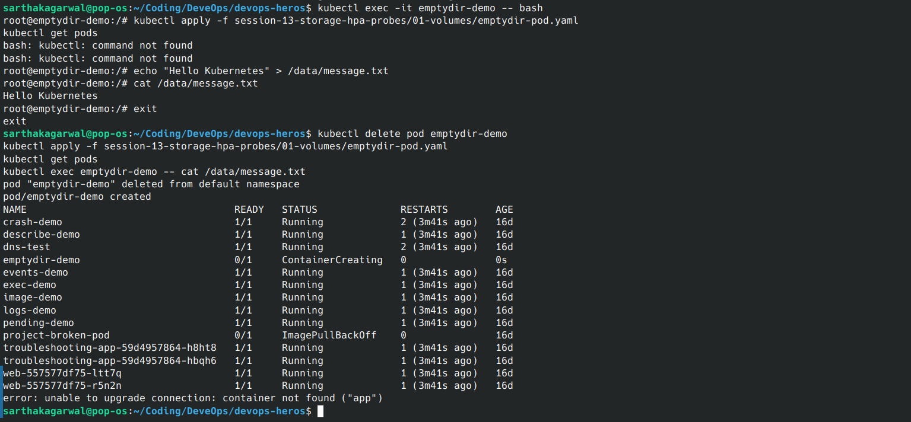

<br><br><br>

### Part B: Node Storage with `hostPath`

Apply the `hostPath` demo Pod:

```bash
kubectl apply -f session-13-storage-hpa-probes/01-volumes/hostpath-pod.yaml
kubectl get pods
kubectl describe pod hostpath-demo
```

Write data to the mounted host path:

```bash
kubectl exec -it hostpath-demo -- bash
```

Inside the container, run:

```bash
echo "Hello from HostPath" > /data/host-data.txt
cat /data/host-data.txt
exit
```

### Screenshot

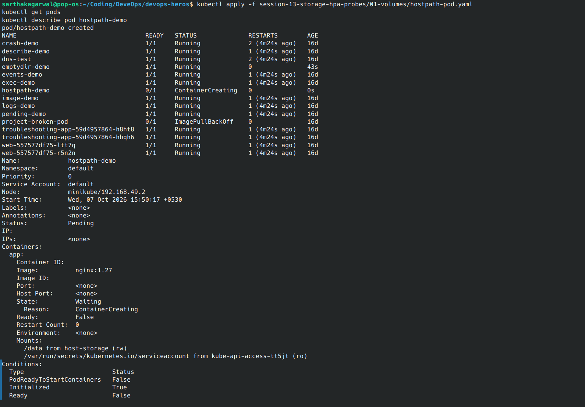

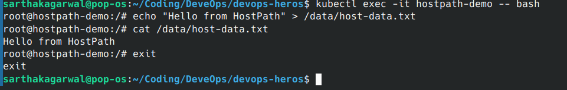

<br><br><br>

---

## 2. Persistent Storage with `PV` and `PVC`

A **PersistentVolume (PV)** provides durable cluster-level storage, while a **PersistentVolumeClaim (PVC)** requests a specific amount and access mode.

Create the PersistentVolume:

```bash
kubectl apply -f session-13-storage-hpa-probes/02-persistent-storage/pv.yaml
kubectl get pv
kubectl describe pv student-pv
```

Create the PersistentVolumeClaim and verify it is `Bound` to `student-pv`:

```bash
kubectl apply -f session-13-storage-hpa-probes/02-persistent-storage/pvc.yaml
kubectl get pvc
kubectl describe pvc student-pvc
```

Create the Pod that mounts the PVC:

```bash
kubectl apply -f session-13-storage-hpa-probes/02-persistent-storage/pod.yaml
kubectl get pods
kubectl describe pod storage-demo
```

Write data into the persistent volume:

```bash
kubectl exec -it storage-demo -- bash
```

Inside the container:

```bash
echo "Kubernetes Storage" > /data/message.txt
cat /data/message.txt
exit
```

Delete the Pod and recreate it to confirm data persistence:

```bash
kubectl delete pod storage-demo
kubectl apply -f session-13-storage-hpa-probes/02-persistent-storage/pod.yaml
kubectl get pods
kubectl exec storage-demo -- cat /data/message.txt
```

Expected output:
```text
Kubernetes Storage
```

### Screenshot

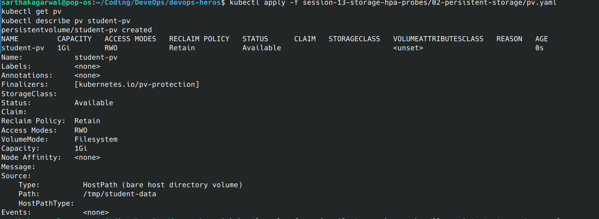

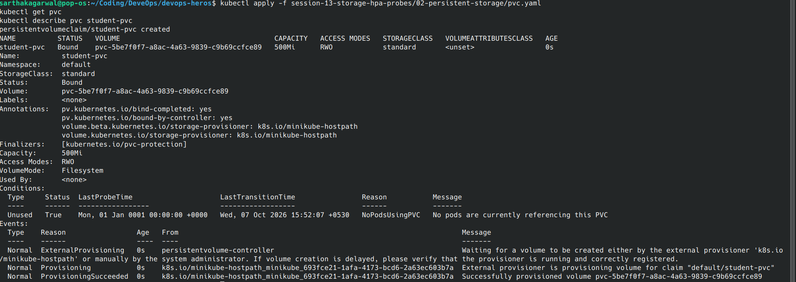

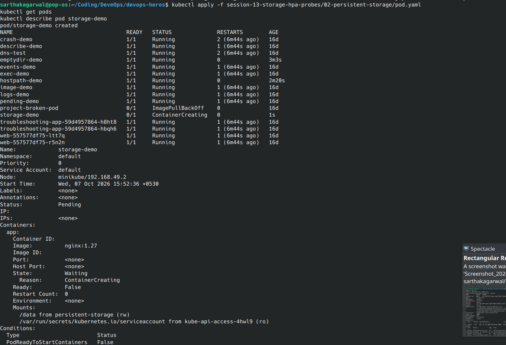

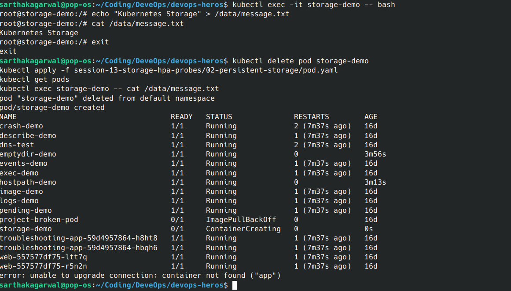

<br><br><br>

---

## 3. Dynamic Storage Provisioning with `StorageClass`

A **StorageClass** enables dynamic provisioning so that PersistentVolumes are automatically created when a PVC is requested.

Inspect available StorageClasses in the cluster:

```bash
kubectl get storageclass
kubectl describe storageclass standard
```

Create a PVC requesting dynamic storage:

```bash
kubectl apply -f session-13-storage-hpa-probes/03-storageclass/pvc.yaml
kubectl get pvc dynamic-pvc
kubectl get pv
```

### Screenshot

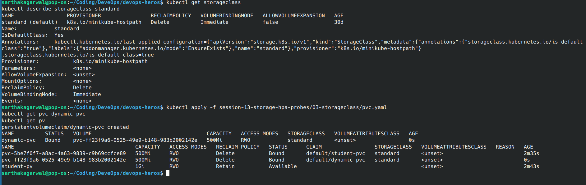

<br><br><br>

---

## 4. Horizontal Pod Autoscaler (`HPA`)

The **Horizontal Pod Autoscaler** automatically scales the number of Pod replicas based on observed CPU utilization.

Verify the Metrics Server is running:

```bash
minikube addons enable metrics-server
kubectl top nodes
kubectl top pods
```

Deploy the sample application and Service with CPU requests and limits:

```bash
kubectl apply -f session-13-storage-hpa-probes/04-hpa/deployment.yaml
kubectl apply -f session-13-storage-hpa-probes/04-hpa/service.yaml
kubectl get deployment hpa-demo
kubectl get pods -l app=hpa-demo
kubectl get svc hpa-demo-service
```

Apply the HPA resource (scales between 1 and 5 replicas based on 50% CPU utilization):

```bash
kubectl apply -f session-13-storage-hpa-probes/04-hpa/hpa.yaml
kubectl get hpa hpa-demo
kubectl describe hpa hpa-demo
```

Generate synthetic load using a busybox Pod:

```bash
kubectl run load-generator \
  --image=busybox:1.36 \
  --restart=Never \
  -- /bin/sh -c \
  "while true; do wget -q -O- http://hpa-demo-service; done"
```

In a separate terminal or watch session, monitor HPA and Pod scaling:

```bash
kubectl get hpa hpa-demo -w
kubectl get pods -l app=hpa-demo -w
```

Stop the load and observe the autoscaler scaling back down:

```bash
kubectl delete pod load-generator
kubectl get hpa hpa-demo -w
kubectl get pods -l app=hpa-demo
```

### Screenshot

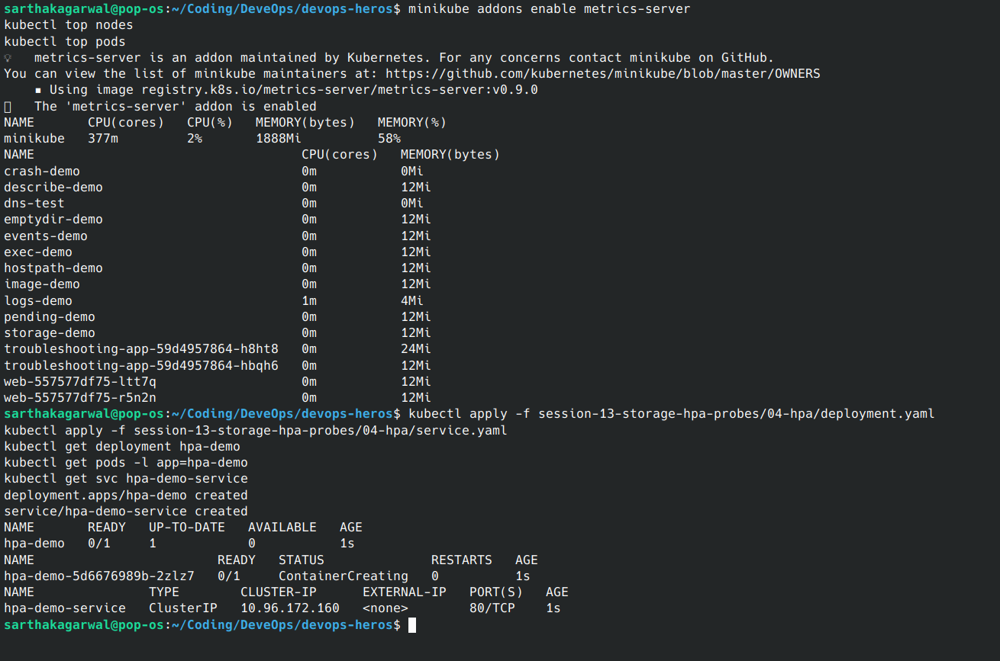

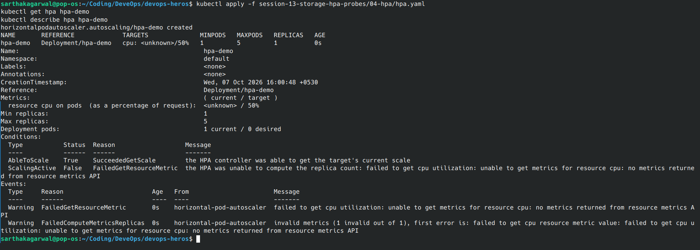

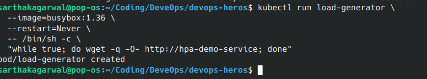

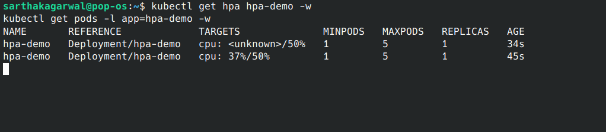

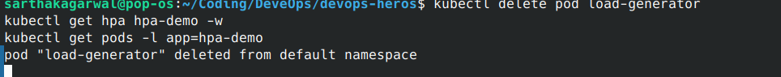

<br><br><br>

---

## 5. Kubernetes Health Probes (`Liveness`, `Readiness`, and `Startup`)

### Part A: Liveness Probe

The **Liveness Probe** checks if the application container is still healthy and running. If it fails repeatedly, Kubernetes restarts the container.

```bash
kubectl apply -f session-13-storage-hpa-probes/05-probes/liveness.yaml
kubectl get pod liveness-demo
kubectl describe pod liveness-demo
```

### Screenshot

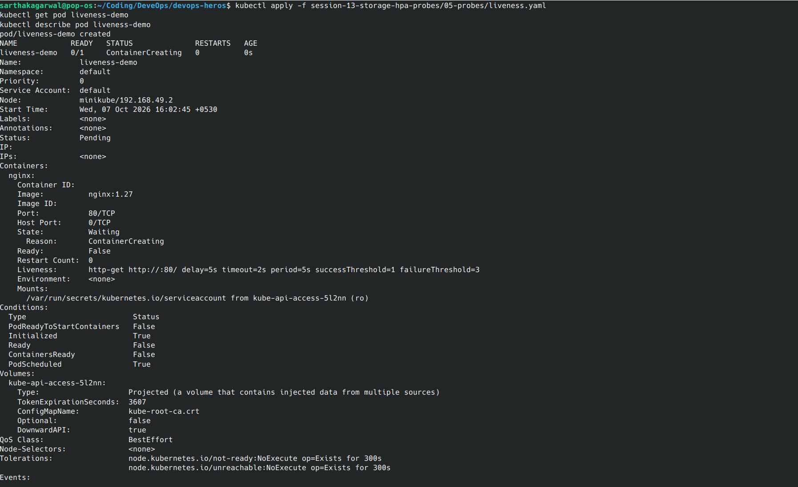

<br><br><br>

### Part B: Readiness Probe

The **Readiness Probe** checks if the application is ready to accept incoming user traffic. If it fails, Kubernetes stops routing traffic to the Pod.

```bash
kubectl apply -f session-13-storage-hpa-probes/05-probes/readiness.yaml
kubectl get pod readiness-demo
kubectl expose pod readiness-demo --name=readiness-service --port=80
kubectl get endpoints readiness-service
kubectl describe pod readiness-demo
```

### Screenshot

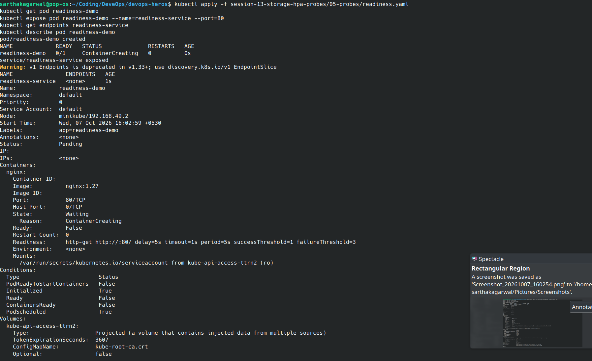

<br><br><br>

### Part C: Startup Probe

The **Startup Probe** protects slow-starting applications by disabling liveness and readiness checks until startup completes successfully.

```bash
kubectl apply -f session-13-storage-hpa-probes/05-probes/startup.yaml
kubectl get pod startup-demo
kubectl describe pod startup-demo
```

### Screenshot

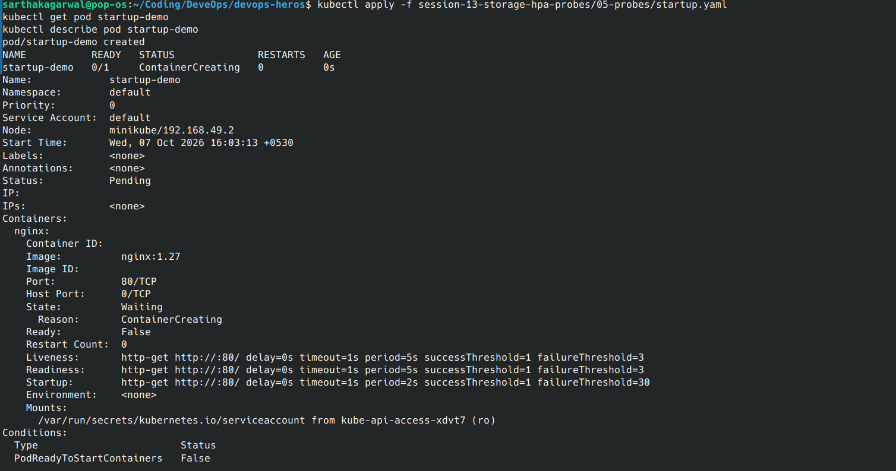

<br><br><br>

---

## 6. Mini-Project: Production-Ready Kubernetes Web App

Deploy a complete production workload combining Persistent Storage, HPA, and all three health probes in the `production-webapp` namespace.

### Step 6.1: Deploy All Resources

```bash
kubectl apply -f session-13-storage-hpa-probes/mini-project/namespace.yaml
kubectl apply -f session-13-storage-hpa-probes/mini-project/pvc.yaml
kubectl apply -f session-13-storage-hpa-probes/mini-project/deployment.yaml
kubectl apply -f session-13-storage-hpa-probes/mini-project/service.yaml
kubectl apply -f session-13-storage-hpa-probes/mini-project/hpa.yaml
```

Inspect all deployed resources:

```bash
kubectl get all -n production-webapp
kubectl get pvc -n production-webapp
kubectl get hpa -n production-webapp
```

### Screenshot

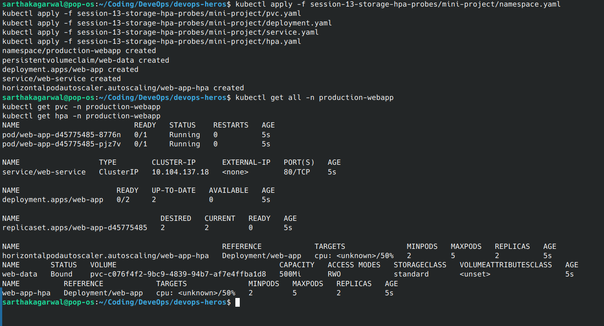

<br><br><br>

### Step 6.2: Verify Storage Persistence

Write data inside one of the running Pods:

```bash
POD_NAME=$(kubectl get pods -n production-webapp -l app=web-app -o jsonpath='{.items[0].metadata.name}')
kubectl exec -n production-webapp "$POD_NAME" -- sh -c 'echo "Student: Sarthak Agarwal" > /data/student.txt'
kubectl exec -n production-webapp "$POD_NAME" -- cat /data/student.txt
```

Delete the Pod and verify data persists in the replacement Pod:

```bash
kubectl delete pod -n production-webapp "$POD_NAME"
NEW_POD=$(kubectl get pods -n production-webapp -l app=web-app -o jsonpath='{.items[0].metadata.name}')
kubectl exec -n production-webapp "$NEW_POD" -- cat /data/student.txt
```

### Screenshot

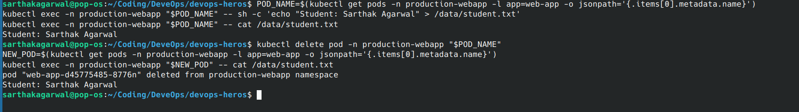

<br><br><br>

### Step 6.3: Verify Service Connectivity

Forward port 80 to your local machine:

```bash
kubectl port-forward -n production-webapp svc/web-service 8080:80
```

In another terminal, test the service endpoint:

```bash
curl http://localhost:8080
```

### Screenshot

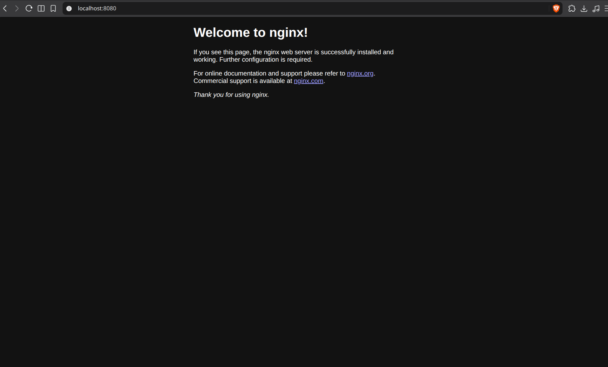

<br><br><br>

### Step 6.4: Trigger HPA Elastic Scaling

Run a load generator inside the namespace:

```bash
kubectl run load-generator -n production-webapp \
  --image=busybox:1.36 \
  --restart=Never \
  -- /bin/sh -c "while true; do wget -q -O- http://web-service; done"
```

Watch the autoscaler scale replicas from 2 to up to 5:

```bash
kubectl get hpa -n production-webapp -w
kubectl get pods -n production-webapp -w
```

Stop the load and observe scale-down:

```bash
kubectl delete pod load-generator -n production-webapp
kubectl get hpa -n production-webapp -w
```

### Screenshot

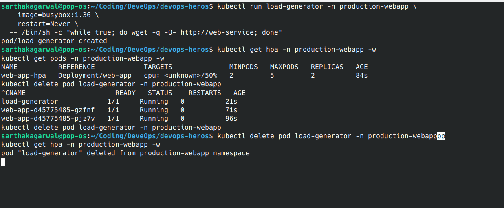

<br><br><br>

---

## 7. Cleanup

Remove all resources created during the exercises:

```bash
# 1. Clean up Volumes and Probes demo Pods and Services
kubectl delete pod emptydir-demo hostpath-demo liveness-demo readiness-demo startup-demo --ignore-not-found
kubectl delete svc readiness-service --ignore-not-found

# 2. Clean up Persistent Storage demo Pod, PVC, and PV
kubectl delete pod storage-demo --ignore-not-found
kubectl delete pvc student-pvc dynamic-pvc --ignore-not-found
kubectl delete pv student-pv --ignore-not-found

# 3. Clean up HPA demo Deployment, Service, and HPA
kubectl delete pod load-generator --ignore-not-found
kubectl delete hpa hpa-demo --ignore-not-found
kubectl delete svc hpa-demo-service --ignore-not-found
kubectl delete deployment hpa-demo --ignore-not-found

# 4. Clean up Mini-Project resources and namespace
kubectl delete -f session-13-storage-hpa-probes/mini-project/hpa.yaml --ignore-not-found
kubectl delete -f session-13-storage-hpa-probes/mini-project/service.yaml --ignore-not-found
kubectl delete -f session-13-storage-hpa-probes/mini-project/deployment.yaml --ignore-not-found
kubectl delete -f session-13-storage-hpa-probes/mini-project/pvc.yaml --ignore-not-found
kubectl delete -f session-13-storage-hpa-probes/mini-project/namespace.yaml --ignore-not-found

# 5. Verify final clean cluster state
kubectl get pods
kubectl get pvc
kubectl get pv
```

### Final Screenshot

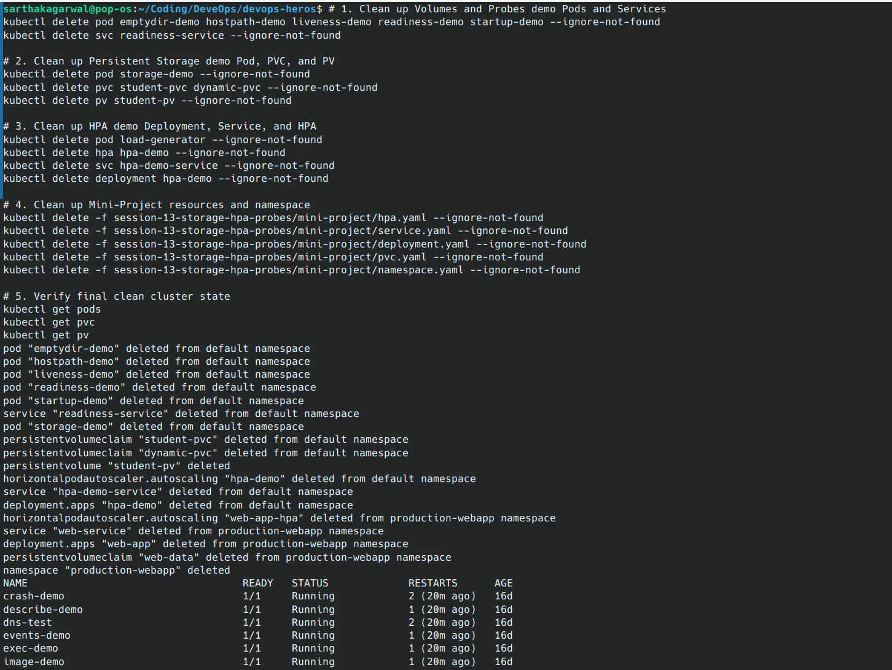

<br><br><br>
