# Session 15: Kubernetes Package Management with Helm Assignment

### `helm list` Screenshot

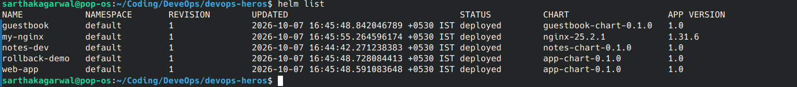

<br><br><br>

### `kubectl get all` Screenshot

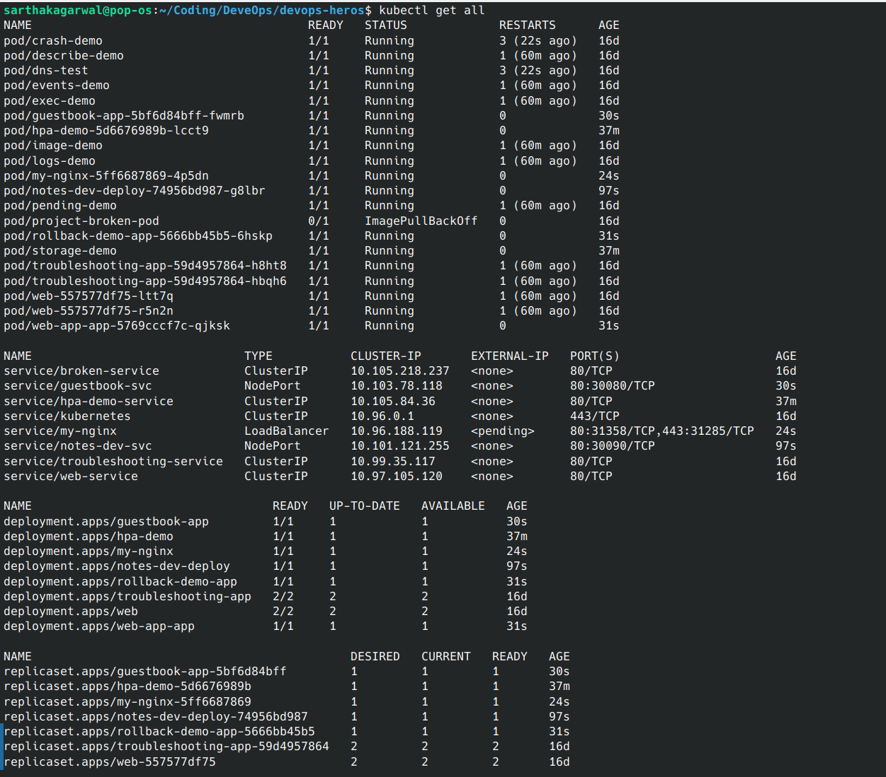

<br><br><br>

Work through the exercises in order. Run the commands from the repository root:


## Prerequisites

- A running Kubernetes cluster (e.g., Minikube)
- `kubectl` configured for the cluster
- `helm` installed on your machine

Check the cluster connection and Helm version:

```bash
kubectl cluster-info
kubectl get nodes
helm version
helm list
```

<br><br><br>

---

## 1. Helm Basics & Managing Helm Repositories

Helm is the package manager for Kubernetes. It packages Kubernetes manifests into reusable, parameterizable charts.

Add the official Bitnami chart repository and update the local repository cache:

```bash
helm repo add bitnami https://charts.bitnami.com/bitnami
helm repo update
```

Search for charts in the repository:

```bash
helm search repo bitnami/nginx
```

Install a sample release from the public repository:

```bash
helm install my-nginx bitnami/nginx
helm list
kubectl get pods
kubectl get svc
```

Uninstall the test release:

```bash
helm uninstall my-nginx
```

### Screenshot

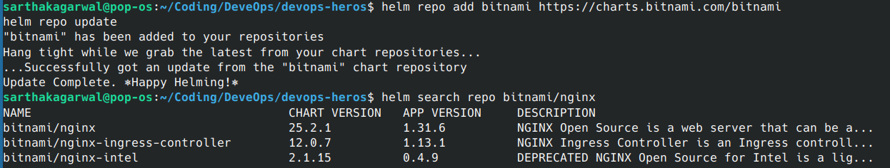

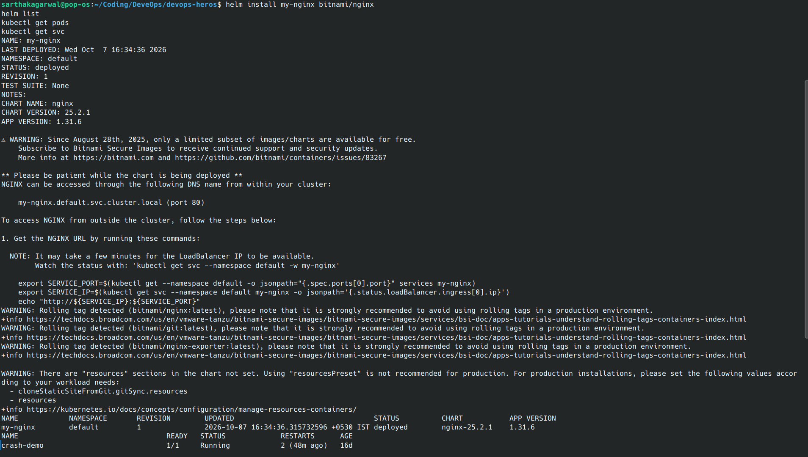

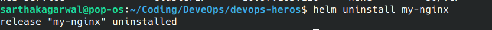

<br><br><br>

---

## 2. Create, Inspect, and Lint a Helm Chart

A Helm chart has a well-defined structure:
- `Chart.yaml`: Metadata (name, version, appVersion).
- `values.yaml`: Default values/parameters.
- `templates/`: YAML manifests with Go template placeholders.

Create a new starter chart:

```bash
helm create demo-chart
ls -la demo-chart
ls -la demo-chart/templates
```

Lint the chart to validate its syntax and adherence to best practices:

```bash
helm lint demo-chart
```

Render the templates locally without deploying anything to the cluster:

```bash
helm template test-release demo-chart
```

### Screenshot

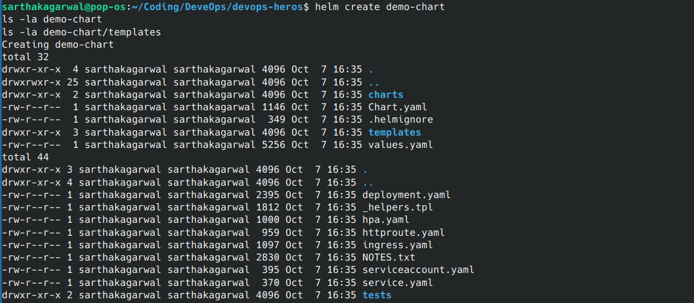

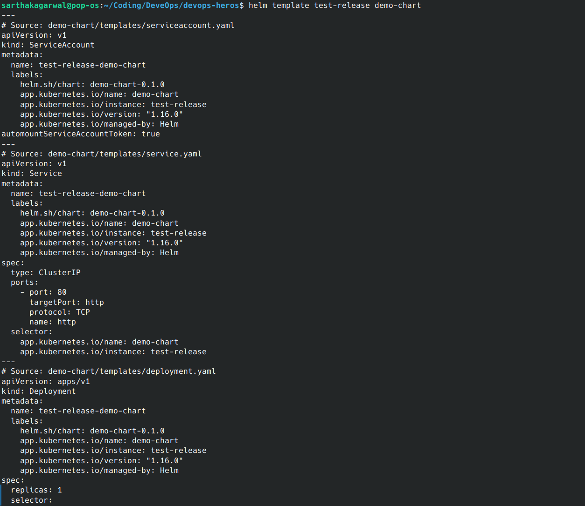

<br><br><br>

---

## 3. Parameterizing Manifests with `values.yaml`

Inspect how default values in `values.yaml` are overridden using `--set` or custom values files.

Check the provided chart in `session-15-helm/05-values-yaml`:

```bash
cat session-15-helm/05-values-yaml/values.yaml
cat session-15-helm/05-values-yaml/values-prod.yaml
```

Render the chart with default values:

```bash
helm template demo-app session-15-helm/05-values-yaml/my-app | grep "replicas:"
```

Override values dynamically using `--set`:

```bash
helm template demo-app session-15-helm/05-values-yaml/my-app --set replicaCount=3 | grep "replicas:"
```

Override values using an environment-specific values file:

```bash
helm template demo-app session-15-helm/05-values-yaml/my-app -f session-15-helm/05-values-yaml/values-prod.yaml | grep "replicas:"
```

### Screenshot

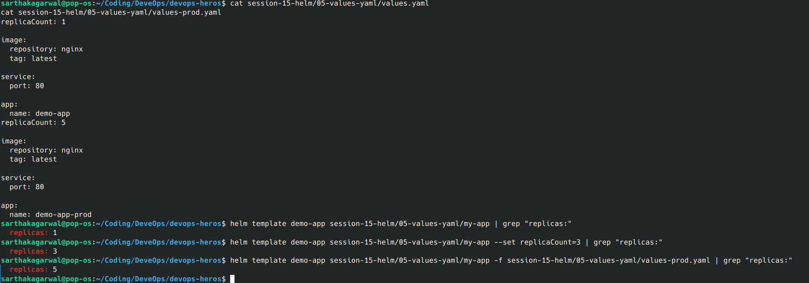

<br><br><br>

---

## 4. Release Lifecycle: `helm install` and `helm upgrade`

Manage the lifecycle of an application through revisions.

Deploy the application chart:

```bash
helm install web-app session-15-helm/07-install-upgrade/app-chart
```

Inspect the release status and pods:

```bash
helm list
kubectl get pods -l app=web-app
```

Upgrade the release to scale up the replicas:

```bash
helm upgrade web-app session-15-helm/07-install-upgrade/app-chart --set replicaCount=3
```

Verify that 3 Pods are running and view the revision history:

```bash
kubectl get pods -l app=web-app
helm history web-app
```

### Screenshot

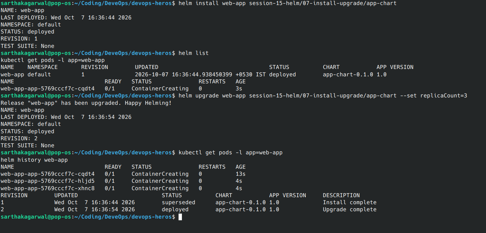

<br><br><br>

---

## 5. Rollback and Disaster Recovery

If an upgrade introduces an error or broken image, Helm can roll back to any previous healthy revision with a single command.

Deploy the rollback demo release:

```bash
helm install rollback-demo session-15-helm/07-install-upgrade/app-chart
kubectl get pods
```

Intentionally simulate a failed upgrade by setting a non-existent container image tag:

```bash
helm upgrade rollback-demo session-15-helm/07-install-upgrade/app-chart --set image.tag=doesnotexist
```

Observe the failed Pod status:

```bash
kubectl get pods
```

Expected output:
```text
NAME                         READY   STATUS             RESTARTS
rollback-demo-app-xxxx       0/1     ImagePullBackOff   0
```

Check the revision history to identify revisions:

```bash
helm history rollback-demo
```

Roll back the release to Revision 1:

```bash
helm rollback rollback-demo 1
```

Confirm that the rollback was successful and the application has returned to a healthy running state:

```bash
kubectl get pods
helm history rollback-demo
```

Clean up the rollback demo release:

```bash
helm uninstall rollback-demo
```

### Screenshot

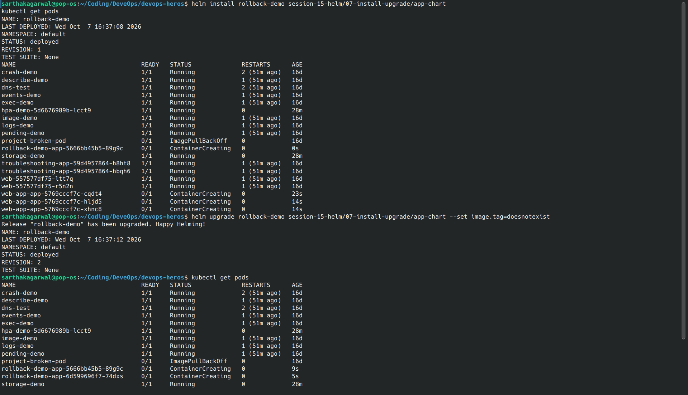

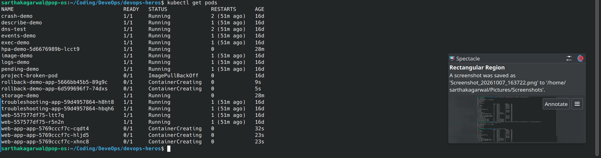

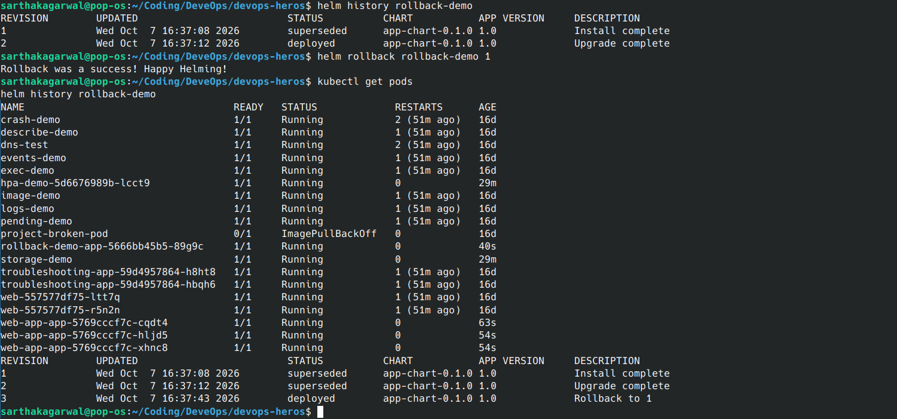

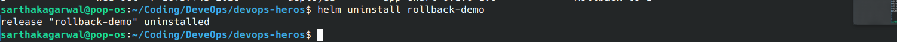

<br><br><br>

---

## 6. End-to-End Application Deployment (`guestbook-chart`)

Deploy a multi-resource application (Deployment, Service, ConfigMap) packaged from scratch.

Lint the Guestbook chart:

```bash
helm lint session-15-helm/09-deploying-application/guestbook-chart
```

Install the Guestbook application:

```bash
helm install guestbook session-15-helm/09-deploying-application/guestbook-chart
```

Verify all deployed Kubernetes resources:

```bash
helm list
kubectl get pods -l app=guestbook
kubectl get svc guestbook-svc
kubectl get configmap guestbook-config -o yaml
```

Upgrade the application with a customized welcome message and replica count:

```bash
helm upgrade guestbook session-15-helm/09-deploying-application/guestbook-chart \
  --set replicaCount=2 \
  --set config.welcomeMessage="Welcome to the Updated Guestbook!"
```

Verify the updated configuration:

```bash
kubectl get pods -l app=guestbook
kubectl get configmap guestbook-config -o yaml
helm history guestbook
```

Clean up the release:

```bash
helm uninstall guestbook
```

### Screenshot

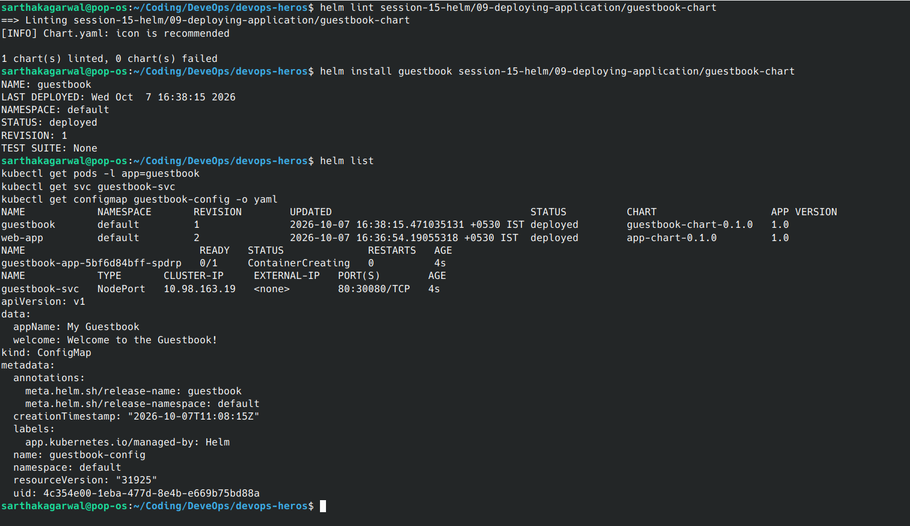

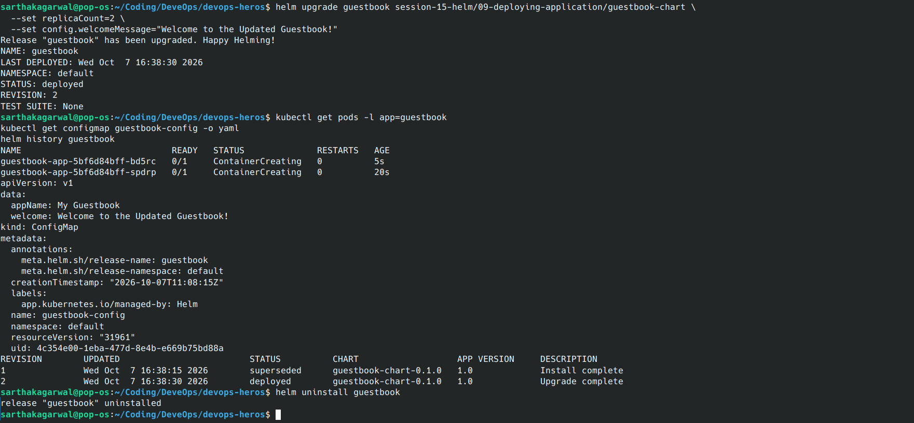

<br><br><br>

---

## 7. Mini-Project: Package and Deploy the Notes App

In this capstone exercise, package, validate, deploy, upgrade, break, and recover a Notes Web Application using Helm.

### Step 7.1: Validate and Lint the Chart

```bash
helm lint session-15-helm/mini-project/notes-chart
```

Expected output:
```text
==> Linting session-15-helm/mini-project/notes-chart
1 chart(s) linted, 0 chart(s) failed
```

Render the template locally to ensure template variables resolve cleanly:

```bash
helm template notes-dev session-15-helm/mini-project/notes-chart
```

### Screenshot

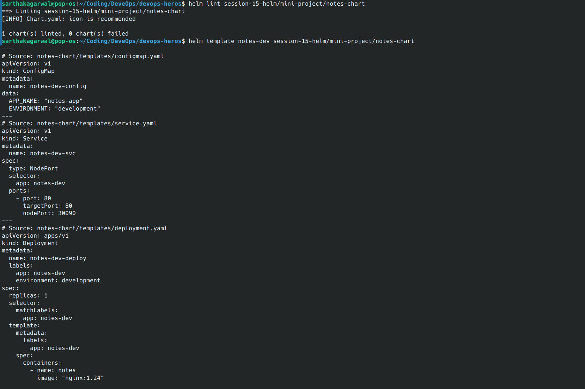

<br><br><br>

### Step 7.2: Deploy Development Environment (Revision 1)

Deploy the chart with default development values (`replicaCount: 1`, `environment: development`):

```bash
helm install notes-dev session-15-helm/mini-project/notes-chart
```

Verify the development release resources:

```bash
helm list
kubectl get pods -l app=notes-dev
kubectl get services notes-dev-svc
kubectl get configmaps notes-dev-config -o yaml
```

### Screenshot

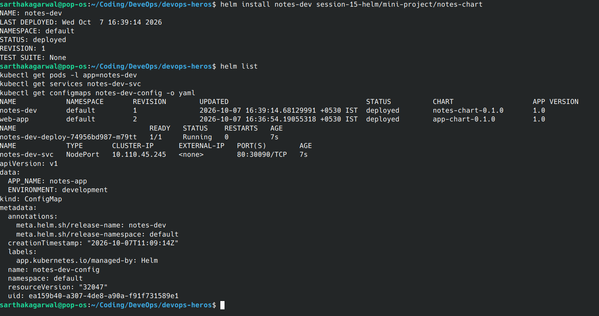

<br><br><br>

### Step 7.3: Upgrade to Production Configuration (Revision 2)

Upgrade the release using the production values file `values-prod.yaml` (`replicaCount: 3`, `environment: production`, `image.tag: "1.25"`):

```bash
helm upgrade notes-dev session-15-helm/mini-project/notes-chart \
  -f session-15-helm/mini-project/notes-chart/values-prod.yaml
```

Verify that 3 Pods are running and that the ConfigMap reflects `ENVIRONMENT: "production"`:

```bash
kubectl get pods -l app=notes-dev
kubectl get configmap notes-dev-config -o yaml
helm history notes-dev
```

### Screenshot

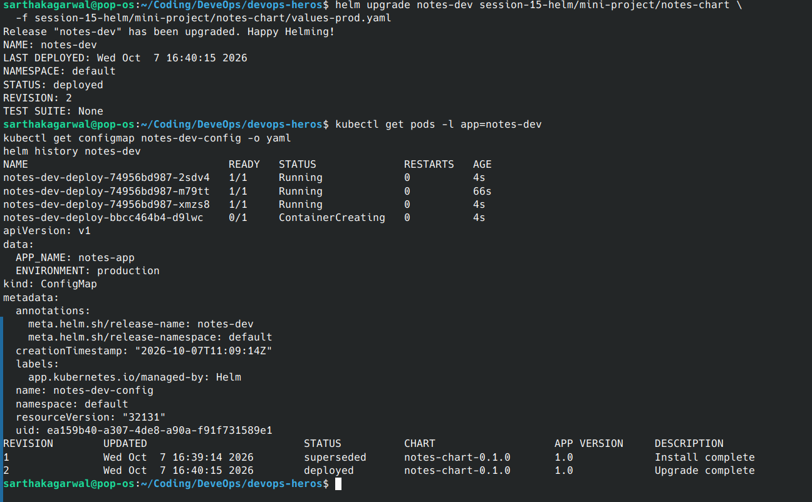

<br><br><br>

### Step 7.4: Simulate Failure and Perform Rollback

Simulate a production incident by upgrading with a non-existent image tag:

```bash
helm upgrade notes-dev session-15-helm/mini-project/notes-chart \
  --set image.tag=broken-tag-does-not-exist
```

Observe the failure:

```bash
kubectl get pods -l app=notes-dev
helm history notes-dev
```

Roll back to the last stable production release (Revision 2):

```bash
helm rollback notes-dev 2
```

Confirm that the application recovered to 3 healthy running Pods:

```bash
kubectl get pods -l app=notes-dev
helm history notes-dev
```

### Screenshot

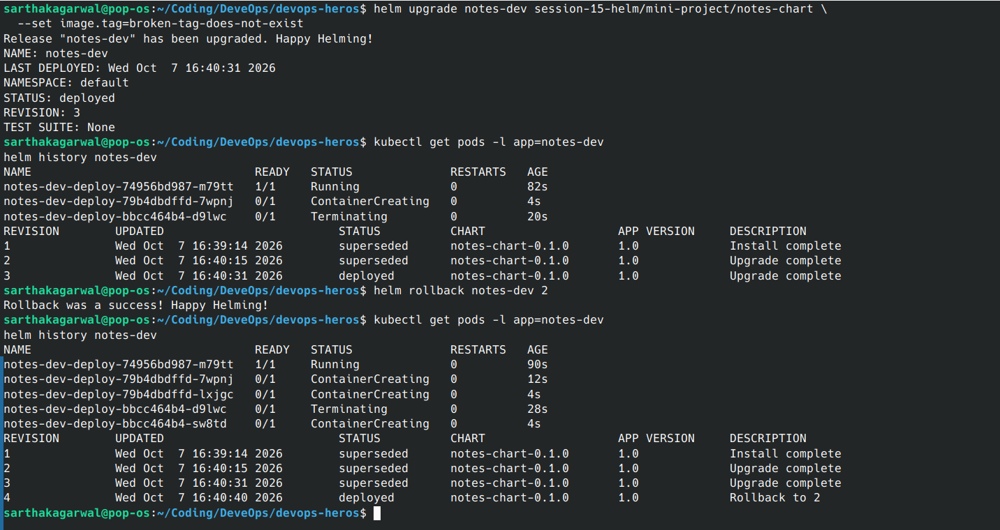

<br><br><br>

---

## 8. Cleanup

Remove all Helm releases and temporary charts created during the exercises:

```bash
# 1. Uninstall any active Helm releases
helm uninstall notes-dev --ignore-not-found
helm uninstall guestbook --ignore-not-found
helm uninstall web-app --ignore-not-found
helm uninstall rollback-demo --ignore-not-found
helm uninstall my-nginx --ignore-not-found

# 2. Remove the locally generated demo-chart directory (if created)
rm -rf demo-chart

# 3. Verify that all releases and cluster resources are cleared
helm list
kubectl get pods
kubectl get svc
kubectl get configmaps
```

### Final Screenshot

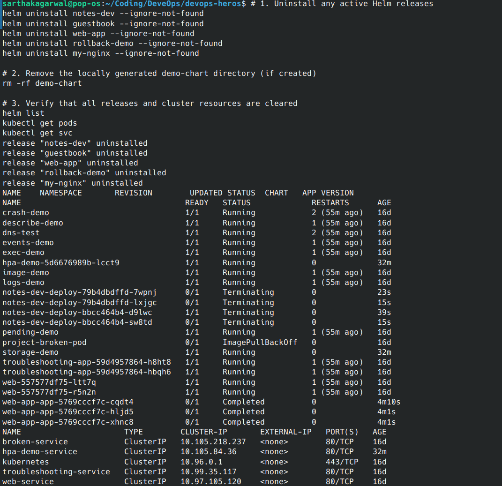

<br><br><br>
