# Session 16: CI/CD and GitHub Actions Assignment

### `gh run list` / GitHub Actions UI Screenshot

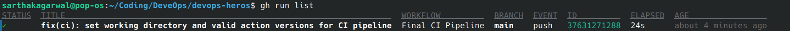

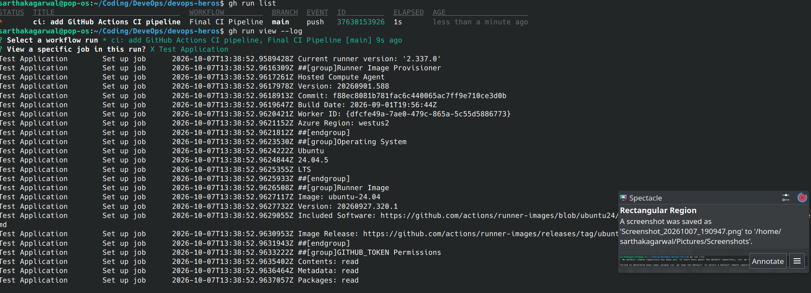

<br><br><br>

### Successful Workflow Run Screenshot

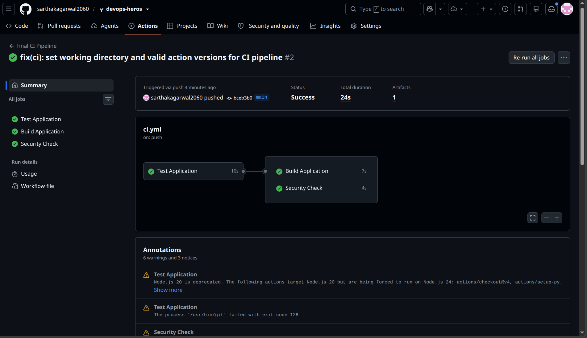

<br><br><br>

Work through the exercises in order. Run the commands from the repository root:

---

## Prerequisites

- Git installed and configured with your GitHub account
- GitHub CLI (`gh`) installed or access to your GitHub repository in a browser
- Python 3 and `pytest` installed for local test execution

Check local tools and authentication status:

```bash
git --version
git status
python3 --version
pytest --version
gh --version
gh auth status
```

<br><br><br>

---

## 1. Local Testing and Build Validation

Before automating steps inside a CI/CD pipeline, verify the application code, unit tests, and build script locally.

Navigate to the application project directory:

```bash
cd session-16-github-actions/session-16-github-actions/10-final-cicd-pipeline
```

Install dependencies:

```bash
python3 -m pip install -r requirements.txt
# If on Pop!_OS / Ubuntu with PEP 668:
# python3 -m pip install --break-system-packages -r requirements.txt
```

Run the Calculator application:

```bash
python3 app/calculator.py
```

Execute the unit tests using `pytest`:

```bash
pytest -v
```

Execute the build script:

```bash
chmod +x build.sh
./build.sh
cat build/build-info.txt
```

Return to the repository root:

```bash
cd ../../..
```

### Screenshot

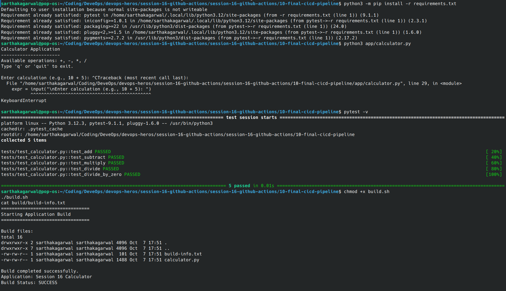

<br><br><br>

---

## 2. GitHub Actions Workflow Structure and Triggers

A GitHub Actions workflow is defined in YAML under `.github/workflows/`. It specifies when automation should run using trigger events (`push`, `pull_request`, `workflow_dispatch`).

Inspect the sample workflow file:

```bash
cat session-16-github-actions/session-16-github-actions/04-workflows/.github/workflows/workflow-demo.yml
```

Notice the key fields:
- `name`: Human-readable workflow title.
- `on`: Events that trigger execution (`push` to `main`, `workflow_dispatch` for manual runs).
- `jobs`: Set of jobs executed on runners.

### Screenshot

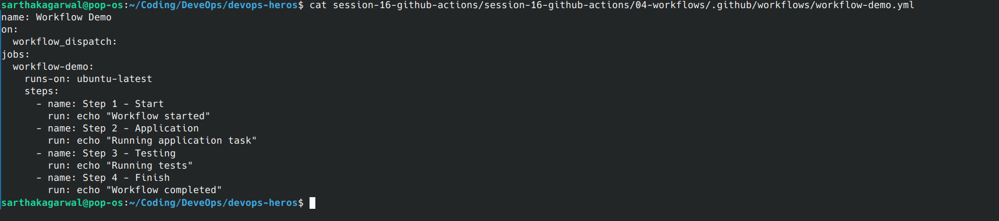

<br><br><br>

---

## 3. Jobs, Steps, and Dependencies (`needs`)

By default, jobs in a workflow execute in parallel. The `needs:` keyword defines dependencies so that jobs run sequentially.

Inspect the multi-job workflow:

```bash
cat session-16-github-actions/session-16-github-actions/05-jobs-and-steps/.github/workflows/jobs-steps.yml
```

Key concepts to observe:
- `uses`: Invokes pre-built actions from GitHub Marketplace (e.g., `actions/checkout@v4`).
- `run`: Executes shell commands directly on the runner VM (`ubuntu-latest`).
- `needs: test`: Ensures the `deploy` or `build` job only starts after the `test` job passes.

### Screenshot

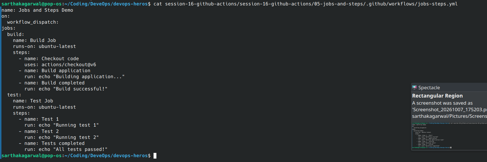

<br><br><br>

---

## 4. Secrets and Environment Variables

Sensitive values such as API tokens, passwords, and deploy keys should never be committed into code. They are stored as encrypted **GitHub Repository Secrets**.

Inspect the secrets demonstration workflow:

```bash
cat session-16-github-actions/session-16-github-actions/07-secrets/.github/workflows/secrets-demo.yml
```

Observe how secrets are referenced:
- Access syntax: `${{ secrets.MY_SECRET }}`
- Injected via environment variables: `env: SECRET_VALUE: ${{ secrets.DATABASE_PASSWORD }}`
- GitHub Actions automatically masks secret values in the console logs (`***`).

### Screenshot

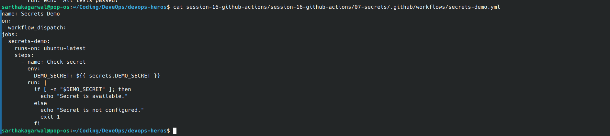

<br><br><br>

---

## 5. Build Artifacts Management

Build artifacts (binaries, compiled files, test reports) can be uploaded from runners and preserved for download or subsequent jobs.

Inspect the artifact upload workflow:

```bash
cat session-16-github-actions/session-16-github-actions/08-artifacts/.github/workflows/artifact-demo.yml
```

Key actions used:
- `actions/upload-artifact@v4`: Saves specified files or folders as downloadable zip packages.
- `actions/download-artifact@v4`: Retrieves artifacts in downstream deployment jobs.

### Screenshot

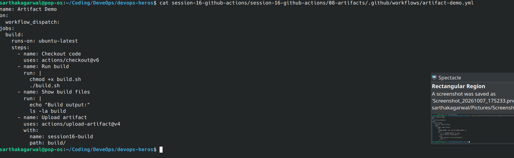

<br><br><br>

---

## 6. Automated Testing and CI Pipelines

A Continuous Integration pipeline automatically checks out code, configures the language runtime, installs dependencies, and runs tests on every commit.

Inspect the build-and-test workflow:

```bash
cat session-16-github-actions/session-16-github-actions/09-build-and-test/README.md
```

Review how test failures prevent broken code from being integrated:
- If all tests pass: Exit code `0` allows the workflow to succeed.
- If any test fails: The step fails, subsequent steps are skipped, and the pull request / commit is marked with a red ❌.

### Screenshot

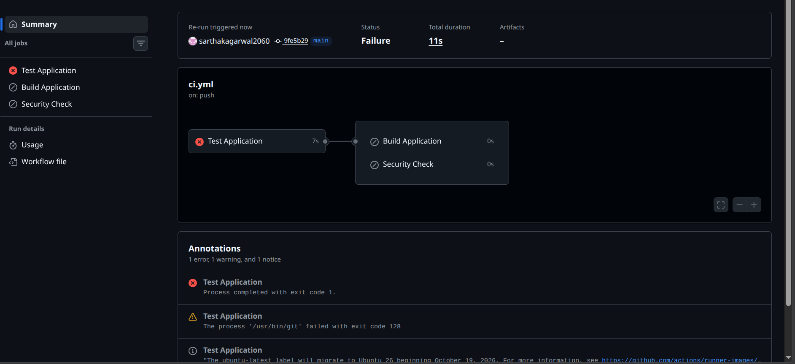

<br><br><br>

---

## 7. Capstone Mini-Project: Complete CI/CD Pipeline

Build and run a complete multi-stage CI pipeline with testing, artifact building, and security file scanning.

### Pipeline Architecture:

```text
       ┌───────────────┐
       │   git push    │
       └───────┬───────┘
               │
       ┌───────▼───────┐
       │   test job    │ (pytest -v)
       └───┬───────┬───┘
           │       │
      PASS │       │ PASS
           │       │
┌──────────▼───┐ ┌─▼───────────────┐
│  build job   │ │  security-check │
│ (build.sh +  │ │ (scans for .env,│
│  artifact)   │ │  *.pem, *.key)  │
└──────────────┘ └─────────────────┘
```

Inspect the final pipeline workflow:

```bash
cat session-16-github-actions/session-16-github-actions/10-final-cicd-pipeline/.github/workflows/ci.yml
```

### Screenshot

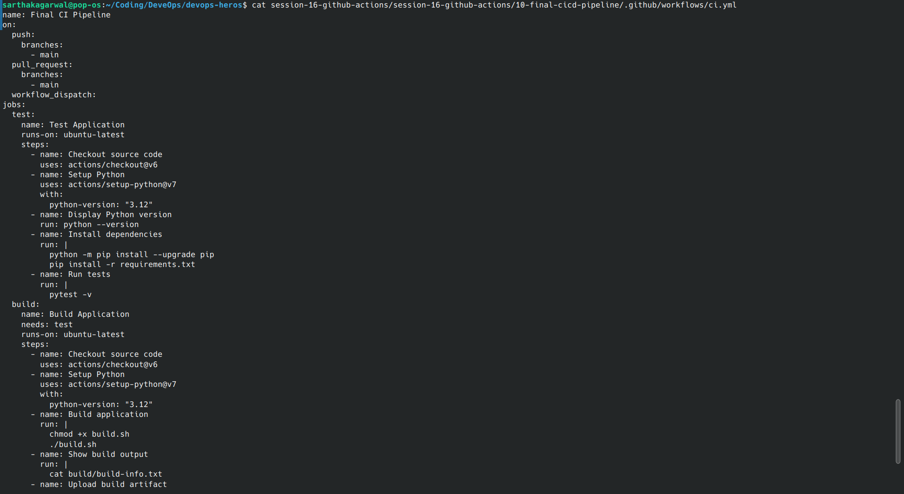

<br><br><br>

### Step 7.1: Verify Pipeline Components

Navigate to the project directory:

```bash
cd session-16-github-actions/session-16-github-actions/10-final-cicd-pipeline
```

1. Check the test suite:
```bash
pytest -v tests/
```

2. Test the security scanning logic locally:
```bash
find . -type f \( -name ".env" -o -name "*.pem" -o -name "*.key" \)
```

3. Build the application package:
```bash
chmod +x build.sh
./build.sh
ls -la build/
cat build/build-info.txt
```

Return to the repository root:

```bash
cd ../../..
```

### Screenshot

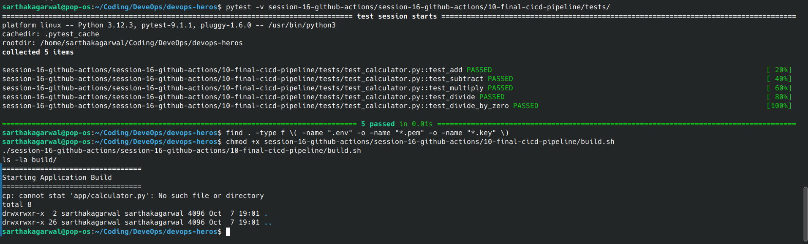

<br><br><br>

### Step 7.2: GitHub Actions Execution and Run Logs

View the workflow run in your repository using GitHub CLI or the GitHub web interface:

```bash
gh run list
```

View the detailed execution log of the latest run:

```bash
gh run view --log
```

Or view the status interactively:

```bash
gh run watch
```

### Screenshot

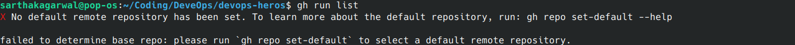


<br><br><br>

### Step 7.3: Verify Uploaded Build Artifact

In the GitHub repository:
1. Navigate to **Actions** → click on the latest **Final CI Pipeline** run.
2. Scroll down to the **Artifacts** section.
3. Confirm that the **`calculator-build`** artifact is generated and downloadable.

### Screenshot


<br><br><br>

---

## 8. Cleanup

Remove local build directories and test caches:

```bash
rm -rf session-16-github-actions/session-16-github-actions/10-final-cicd-pipeline/build \
       session-16-github-actions/session-16-github-actions/10-final-cicd-pipeline/.pytest_cache \
       session-16-github-actions/session-16-github-actions/10-final-cicd-pipeline/app/__pycache__ \
       session-16-github-actions/session-16-github-actions/10-final-cicd-pipeline/tests/__pycache__
```

Verify that the local repository is clean:

```bash
git status
```

<br><br><br>
